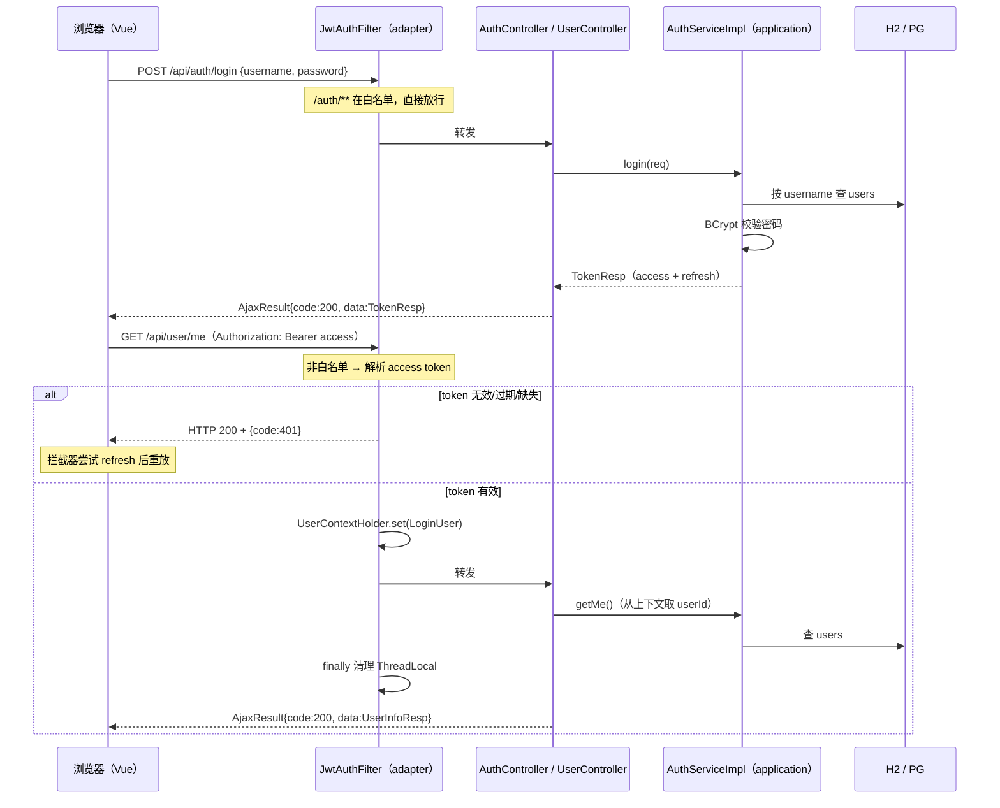

# 场景 01 · 用户登录与认证（JWT）设计文档

> 需求名称：用户登录与认证（JWT） · 文件 slug：`auth-jwt` · 任务前缀：`auth-jwt`
> 契约状态：**冻结基线**（阶段一确认后，前后端以此文档「六、接口设计」为唯一事实并行开发）

## 一、需求概述

在现有前后端基座上实现完整的用户认证闭环：**注册 → 登录 → 携带 token 访问受保护接口 → 无感续期 → 登出**。

- 谁在用：任何需要区分"你是谁"的前后端应用；本仓库把它作为场景 01 的经典复现。
- 核心链路：用户提交账号密码 → 后端校验并签发 JWT（access + refresh 双 token）→ 前端存 localStorage 并在请求头携带 → 后端过滤器解析 token 注入用户上下文 → 受保护接口按上下文返回数据 → access 过期时前端用 refresh 静默换新。
- 用户目标：跑通"注册、登录、查看我的信息、token 续期、登出"五件事，并在场景笔记中记录设计取舍与坑。

**非目标**（本场景不做）：

- SSO 单点登录与第三方 OAuth（README 场景名含 SSO，留作后续扩展）；
- RBAC 角色权限（场景 08 单独做，本场景只有"登录/未登录"两态）；
- 验证码、防爆破限流、token 黑名单/服务端吊销、多端登录互踢；
- 找回密码、改密码、用户资料编辑。

## 二、需求头脑风暴（方案取舍）

| 决策点 | 选了什么 | 没选什么 | 为什么 |
| --- | --- | --- | --- |
| 认证框架 | jjwt + 自研 OncePerRequestFilter（用户已确认） | Spring Security 6 过滤链 | 贴合现有 MyBatis-Plus 风格基座；不与现有 CorsConfig/GlobalExceptionHandler 冲突；复现"手写认证"比复现"配置框架"更有学习价值 |
| Token 策略 | 双 token：短效 access + 长效 refresh，刷新时旋转双发（用户已确认） | 单 access token | 无感续期是生产经典方案；单 token 过期即跳登录，复现价值低 |
| 密码哈希 | spring-security-crypto 的 `BCryptPasswordEncoder`（strength 10） | 引入完整 Spring Security；hutool-crypto | crypto 是独立轻模块（只含密码学工具，无过滤链/自动配置）；比 MD5/SHA 安全，带盐且慢哈希 |
| 签名算法 | HS256 对称密钥（secret ≥ 32 字节，配置于 `app.jwt.secret`） | RS256 非对称 | 单服务自签自验，无多方验签需求；RS256 留作 SSO 扩展笔记 |
| 登出语义 | 前端清除 localStorage（无后端接口） | token 黑名单 / Redis 白名单 | 无状态 JWT 服务端不存会话；黑名单需要引入存储，超出本场景边界，局限记入笔记 |
| 用户来源 | 注册接口 + data.sql 预置演示账号 | 仅预置账号（用户已确认含注册） | 注册+登录才是完整闭环；H2 每次重启清空，预置账号保证开箱可验 |
| 表名 | `users` | `user` | `USER` 是 H2/PostgreSQL 双方言保留字，直接用必踩坑 |
| token 存储 | localStorage + `Authorization: Bearer` 头 | Cookie | 避免 CSRF；XSS 风险与缓解记入笔记 |
| 样式体系 | Tailwind CSS v4（`@tailwindcss/vite` + `@theme` token，用户指定） | 继续扩充手写全局 CSS 类 | design-system 统一为 Tailwind：utility-first 免命名负担；既有 CSS 变量值整体迁入 `@theme`，色板不变 |
| 401 传输形式 | HTTP 200 + body `code=401`（跟 `GlobalExceptionHandler` 现状一致） | HTTP 401 状态码 | 项目统一响应约定是 HTTP 200 + 业务码；前端 `http.js` 已按 `code!==200` reject，两侧契约一致 |

## 三、数据模型设计

### 表结构：`users`（新建）

| 字段 | 类型 | 约束 | 说明 |
| --- | --- | --- | --- |
| id | BIGINT | PK | 雪花算法（`BaseIdEntity` 的 `ASSIGN_ID`） |
| username | VARCHAR(50) | NOT NULL，UNIQUE | 登录名，4–32 位字母数字下划线 |
| password | VARCHAR(100) | NOT NULL | BCrypt 哈希（60 字符，留余量） |
| nickname | VARCHAR(50) | NULL | 昵称，注册可选，缺省同 username |
| create_time / update_time | TIMESTAMP | 自动填充 | `BaseEntity` + `MyMetaObjectHandler` |
| create_by / update_by | BIGINT | NULL | 沿用现状不填充（`MyMetaObjectHandler` 未接入认证上下文，不在本场景扩散改造） |
| deleted | INT | DEFAULT 0 | 逻辑删除（`@TableLogic`） |

实体 `User extends BaseIdEntity`，`@TableName("users")`；唯一索引兜底并发重名注册（先查后插 + 捕获重复键异常转 409）。

### 数据变更策略（项目无迁移工具，遵循 README「表结构由各场景手工初始化」约定）

| 环境 | 落位 | 执行主体与时机 |
| --- | --- | --- |
| H2（默认/测试） | `demo-starter/src/main/resources/schema.sql`、`data.sql` | Spring Boot 启动时自动执行（`spring.sql.init` 对内嵌库默认开启）；测试 classpath 含 main 资源，测试库同样有表和种子数据 |
| PostgreSQL | `scenarios/01-auth/sql/postgresql.sql`（DDL + 种子数据合一） | DBA/开发者手工执行，与 H2 版本语义一致 |
| 回滚 | H2 重启即空，天然回滚；PG 手工 `DROP TABLE users` | 记录于场景笔记 |

`data.sql` 预置演示账号：`demo / demo123456`（BCrypt 哈希在实现时生成后写死）。

## 四、业务流程

### 登录与请求鉴权（主链路，细节时序）

### 前端 token 无感续期

1. 响应拦截器收到 `code=401` 且存在 refreshToken → 挂起原请求，单飞调用 `POST /auth/refresh`；
2. 刷新成功 → 更新存储的 token 对 → 重放原请求（并发 401 共享同一次刷新）；
3. 刷新失败（refresh 也过期/无效）→ 清空认证 store → 跳转 `/login?redirect=原路径`。

## 五、影响范围

### 后端（按模块，遵循依赖方向 shared ← domain ← infrastructure；domain+client ← application；application+client ← adapter）

| 模块 | 变更 |
| --- | --- |
| `backend/pom.xml`（根） | dependencyManagement 增 jjwt 三件套（api/impl/jackson）、spring-security-crypto 版本 |
| `demo-shared` | `LoginUser`（上下文载体）、`UserContextHolder`（ThreadLocal 存取）、认证常量（白名单路径、header 名、token 类型 claim） |
| `demo-domain` | `User` 实体（`users` 表映射，继承 `BaseIdEntity`）；`UserGateway` 领域网关接口（application 经此访问持久化，不触碰 MyBatis 细节） |
| `demo-client` | `client/service/AuthService`、`UserService` 接口；`client/dto/`：`RegisterReq`、`LoginReq`、`RefreshReq`、`TokenResp`、`UserInfoResp`；`client/service/TokenProvider` **端口接口**（签发/解析，供 application 依赖倒置） |
| `demo-application` | `AuthServiceImpl`（注册/登录/刷新）、`UserServiceImpl`（getMe）；`PasswordEncoderConfig`（BCrypt Bean） |
| `demo-infrastructure` | `UserMapper`（`@MapperScan` 固定扫描 `com.fullstack.demo.infrastructure.mapper` 包，必须落位于此）；`UserGatewayImpl` 实现 domain 的 `UserGateway`（委托 Mapper）；`JwtTokenProvider` 实现 `TokenProvider`（jjwt 签发/解析，HS256）；`JwtProperties`（`app.jwt.*`）；pom 增 demo-client 依赖（实现 client 端口契约可见） |
| `demo-adapter` | `AuthController`、`UserController`；`JwtAuthFilter`（OncePerRequestFilter，白名单放行、OPTIONS 放行、失败自写 `AjaxResult{code:401}` JSON——过滤器异常不经过 `@RestControllerAdvice`）；`AuthFilterConfig`（FilterRegistrationBean 注册，只拦 `/user/**`，白名单 `/auth/*`、`/health` 不经过过滤逻辑） |
| `demo-starter` | `application.yml` 增 `app.jwt.*`（secret、access/refresh 有效期）；**测试 `application.yml` 同步**（同名文件遮蔽主配置，漏加会导致测试失败）；`schema.sql`、`data.sql` |

关键点：application 层不依赖 infrastructure（AGENTS 依赖方向），两处端口反转——签发 token 经 client 的 `TokenProvider` 端口（jjwt 实现在 infrastructure）；访问用户数据经 domain 的 `UserGateway` 端口（`UserGatewayImpl` 委托 `UserMapper`）。实现由 starter 装配（与 `demo-client/README.md` 的 Feign 预留同一思路）。

### 前端（`frontend/`）

| 文件 | 变更 |
| --- | --- |
| `src/api/http.js` | 请求拦截器注入 `Authorization`；响应拦截器 401 单飞刷新 + 重放 + 失败跳登录（不改变现有 `code!==200` reject 行为） |
| `src/api/auth.js`（新） | register / login / refresh |
| `src/api/user.js`（新） | getMe |
| `src/stores/auth.js`（新） | token 对 + 用户信息，localStorage 持久化，login/logout/refresh actions |
| `src/router/index.js` | 新增 `/login`、`/register`；`/` 改 `meta.requiresAuth`；全局前置守卫（白名单放行，未登录带 redirect 跳登录） |
| `src/views/LoginView.vue`、`RegisterView.vue`（新） | 表单页，Tailwind utilities + `@theme` token 构建 |
| `src/views/HomeView.vue` | 顶部展示当前用户 + 登出按钮（保留健康检查/计数器演示） |
| `vite.config.js` | 接入 `@tailwindcss/vite` 插件 |
| `package.json` | 新增 devDependencies：`tailwindcss` + `@tailwindcss/vite`（v4，版本以 npm registry 为准） |
| `src/style.css` | 改为 Tailwind 入口：`@import "tailwindcss"` + `@theme` 迁移既有 CSS 变量（值不变，映射见 `frontend/design-system/tokens.md`）；`App.vue`/`HomeView.vue` 存量全局类一次性改写为 utilities，避免双体系并存 |

### 文档与配置

| 位置 | 变更 |
| --- | --- |
| `README.md` | 场景索引 01 状态 → 🚧 进行中（完成后 → ✅ 并链笔记） |
| `scenarios/01-auth/design.md` | 纯场景讲义（前端技术文档页渲染）；踩坑与实测记入本文档「十、踩坑与实测」 |
| `AGENTS.md` | 更新「未接入认证」相关表述（GlobalExceptionHandler 注释、createBy 说明处一并核对） |
| CORS 白名单 | 无需变更（前端仍走 5173 代理） |

## 六、接口设计（冻结契约）

统一约定：路径均含 context-path `/api`；请求/响应 JSON；响应包 `AjaxResult{code, msg, data}`，成功 `code=200`；参数校验失败 `code=417`；认证失败 `code=401`；重名冲突 `code=409`。`Authorization: Bearer <accessToken>`。

### 1. POST /auth/register（公开）

- 请求：`RegisterReq{ username: 4-32位字母数字下划线, password: 6-64位, nickname?: ≤50字符 }`（`@NotBlank`/`@Pattern` 校验）
- 成功：`data: TokenResp`（注册即登录，免二次登录跳转）
- 失败：用户名已存在 → `code=409, "用户名已被注册"`；校验失败 → `code=417`
- 数据操作：**写** `users` 一行（BCrypt 哈希入库，nickname 空则取 username）；唯一索引兜底并发重名（捕获重复键 → 409）

### 2. POST /auth/login（公开）

- 请求：`LoginReq{ username, password }`
- 成功：`data: TokenResp{ accessToken, refreshToken, tokenType:"Bearer", accessExpiresIn(秒), userId, username, nickname }`
- 失败：用户不存在或密码错误 → 统一 `code=401, "用户名或密码错误"`（不区分暴露哪个错）
- 数据操作：**读** `users` 按 username（含 deleted=0）

### 3. POST /auth/refresh（公开）

- 请求：`RefreshReq{ refreshToken }`
- 成功：`data: TokenResp`（**旋转双发**：新 access + 新 refresh，旧对自然过期）
- 失败：refresh 无效/过期/type 不是 refresh → `code=401, "refreshToken 无效或已过期"`
- 数据操作：token 为无状态校验（HS256 验签 + exp + type claim），不查库；userId/username 取自 claims

### 4. GET /user/me（受保护）

- 请求：无参数，需有效 access token
- 成功：`data: UserInfoResp{ id, username, nickname, createTime }`
- 失败：缺 token/过期/验签失败 → `code=401, "暂未登录或token已经过期"`
- 数据操作：**读** `users` 按 `UserContextHolder` 中的 userId（查库取最新昵称等，不信任 token 里的可变资料）

### Token 内部格式（HS256，secret ≥ 32 字节，配置 `app.jwt.secret`）

- claims：`sub=userId`、`username`、`type=access|refresh`、`iat`、`exp`
- 默认有效期：access 30 分钟、refresh 7 天（`app.jwt.access-expire-seconds` / `refresh-expire-seconds` 可配）

## 七、模块拆分建议

1. 后端数据与领域基座（根 pom + schema + 实体/Mapper + starter 配置）；
2. 后端认证核心（shared 上下文 → client 端口/DTO → domain → infrastructure JWT → application 服务）；
3. 后端 Web 层与过滤器（adapter Controller + JwtAuthFilter + 白名单）；
4. 后端集成测试（注册→登录→me→refresh→401/409 全链路，随机 H2）；
5. 前端 Tailwind 接入（安装 v4 + vite 插件、`@theme` token 迁移、存量样式改写为 utilities、`npm run build` 验证）；
6. 前端认证设施（store + http 拦截器/刷新队列 + API 模块 + 路由守卫）；
7. 前端页面（登录/注册页 + HomeView 改造，基于 utilities）；
8. 前后端联调验证（手动验收清单 + curl 脚本）；
9. 文档收尾（design.md 踩坑与实测、README 场景状态、AGENTS.md 表述更新）。

依赖关系：1 → 2 → 3 → 4；5 独立即可开工；6 依赖契约冻结（2 完成前可先用 mock）；7 依赖 5+6；联调 8 依赖两侧（4 与 7）；9 收尾。

## 八、非功能性需求

- **安全**：密码只存 BCrypt 哈希且不落日志；secret 不硬编码进代码（yml 配置 + dev 默认值 + 注释警示生产必须替换）；token 不进 Cookie；登录失败信息不区分用户名/密码错误。
- **已知局限**（如实记录到「十、踩坑与实测」）：无状态 JWT 无法服务端吊销，登出仅前端清除；refresh 无黑名单，旋转前的旧 refresh 在过期前仍可用；HS256 单机 secret 无多实例密钥分发；无验证码/限流（`ResultCodeEnum` 已预留 429）。
- **兼容性**：`/api/health` 行为不变；现有 `http.js` 解包行为不变；未登录访问受保护页由路由守卫拦截。
- **性能**：登录 1 次 BCrypt 校验（~几十毫秒，可接受）；每请求 1 次 HMAC 验签（微秒级）+ me 查库 1 次。
- **可观测**：过滤器 401 打 warn 日志（不含 token 原文）；注册/登录成功打 info（不含密码）。

## 九、开发与验证建议

- 后端验证：`cd backend && mvn test`（新增认证流程集成测试；现有 `contextLoads` 不回退）；
- 前端验证：`cd frontend && npm run build`（无 lint/test 配置，如实以构建为校验 + 手动验收）；
- 手动验收清单：注册即登录 → 刷新页面保持登录 → 登出后访问 `/` 被踢到登录页 → 重新登录 → `demo/demo123456` 亦可登录 → 手工把 accessExpiresIn 调短观察无感续期 → 篡改 token 后请求返回 401；
- 实现顺序按「七、模块拆分建议」，每步跑最小验证再进下一步。

## 十、踩坑与实测

本仓库复现时的实际记录（环境：Windows + IDEA + H2）。

**实测结果**：

- 后端集成测试 11/11（`AuthFlowIntegrationTest` 10 用例 + contextLoads）；
- curl 冒烟 `verify.sh` 7/7（注册/me/无 token 401/伪造 401/旋转刷新/demo 登录/文案统一）；
- 浏览器手动验收 8/8（守卫重定向、注册即登录、F5 保持登录、登出、demo 登录、密码错误提示、无感续期、全过期跳登录——后两项以临时 TTL 30s/90s 实测，验后已恢复）；
- 未做压测：瓶颈在登录 BCrypt 校验（约几十 ms/次，量级已知），过滤器验签为微秒级。

**踩坑记录**：

| 现象 | 原因 | 解决 |
| ---- | ---- | ---- |
| application 层注入 UserMapper 编译报「程序包不存在」 | 依赖方向 application 不可见 infrastructure，而 `@MapperScan` 只扫 infrastructure.mapper | domain 定义 `UserGateway` 端口、infrastructure 用 GatewayImpl 实现，application 只依赖接口 |
| jjwt 依赖解析超时（连内网镜像失败） | 用户级与安装级 settings.xml 都配了同一个当前不可达的内网镜像 | 临时 settings 从 Maven Central 下载；注意 `_remote.repositories` 记录的仓库 ID 与镜像不匹配时本地构件也会重新解析 |
| 集成测试 404「No static resource」 | TestRestTemplate 自动携带 context-path，测试路径再写 `/api` 双重前缀 | 测试路径只写 servlet 内路径（`/auth/login`），不带 `/api` |
| 同一秒内登录两次，两次 access token 字节级相同 | jjwt 的 iat/exp 秒级精度，claims 全等 → HMAC 签名全等，JWT 是确定性输出 | 签发时加 jti（UUID）claim 保证唯一（也是黑名单吊销挂载点） |
| 种子账号昵称前端乱码 | data.sql 是 UTF-8，Windows 下 `spring.sql.init` 默认按平台编码（GBK）读脚本 | `spring.sql.init.encoding: UTF-8`（主/测试 yml 都要加） |
| curl 冒烟注册返回 417「请求体格式错误」 | `-d` 中文载荷被 Windows 控制台编码损坏成非法 JSON | 脚本载荷一律 ASCII；`set -e` 下 `test A && test B` 非末位失败不退出，改显式 if 守卫 |
| 用健康检查按钮验证「无感续期」永远成功 | `/health` 在白名单，不带 token 也不经过过滤器，走不到 401 分支 | 验证载体换成受保护接口（页面刷新触发 `/user/me`） |
| 路由切换加 `<Transition mode="out-in">` 偶发空白/卡旧页 | 过渡状态机与懒加载视图组合不可靠，被打断时离场不完成且无控制台报错 | 放弃组件级 Transition：视图根元素自带 `animate-fade-up` 入场动画（挂载即播，无可卡状态） |
