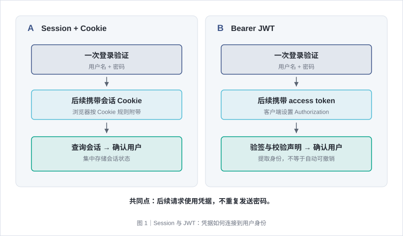
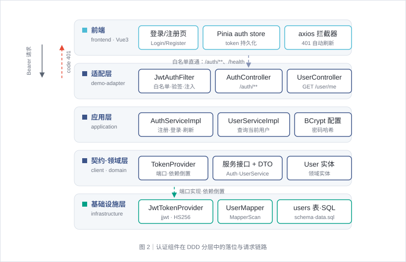
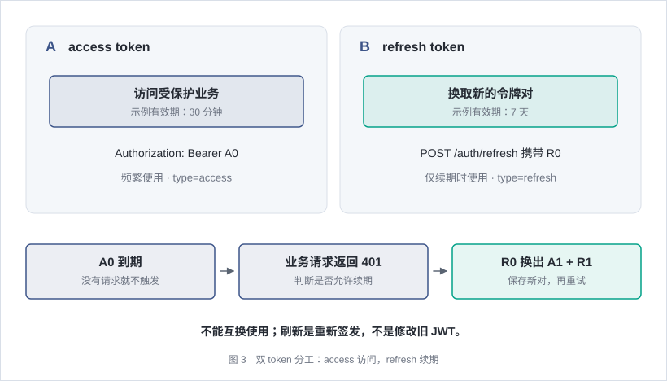
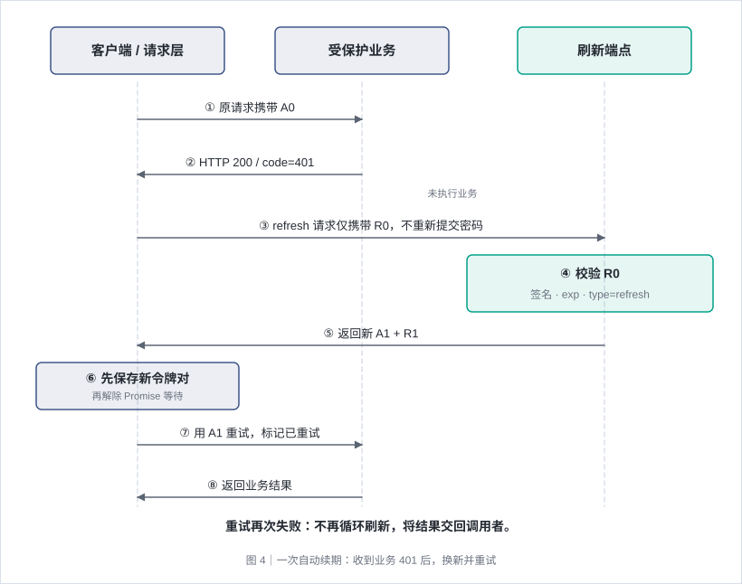
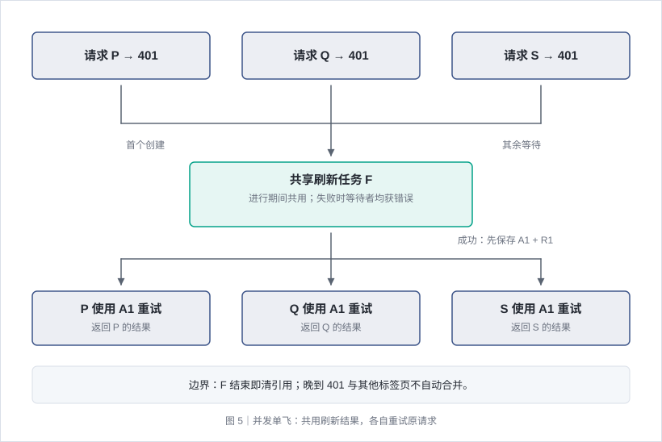
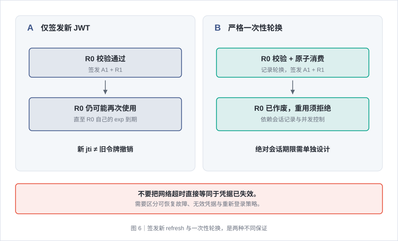
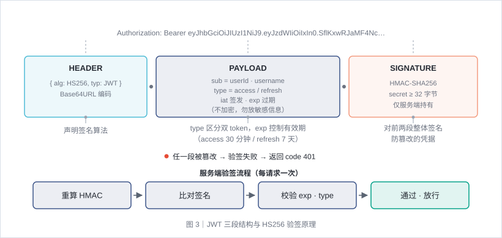
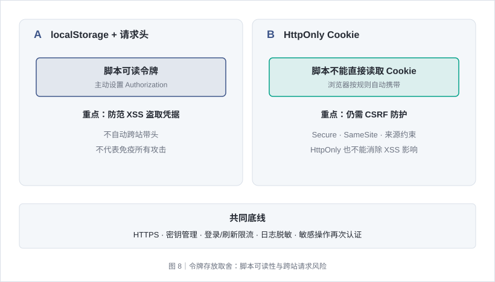
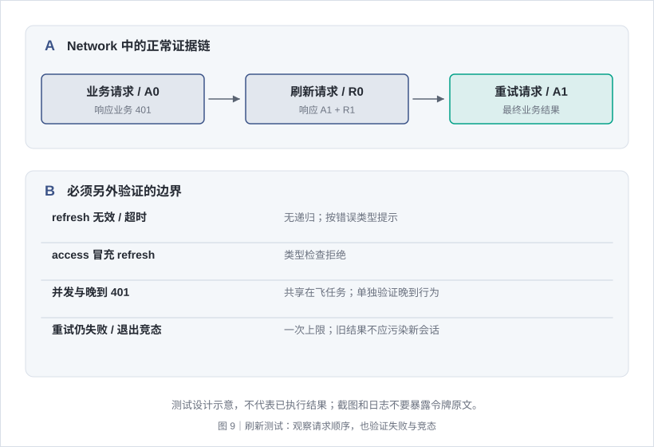
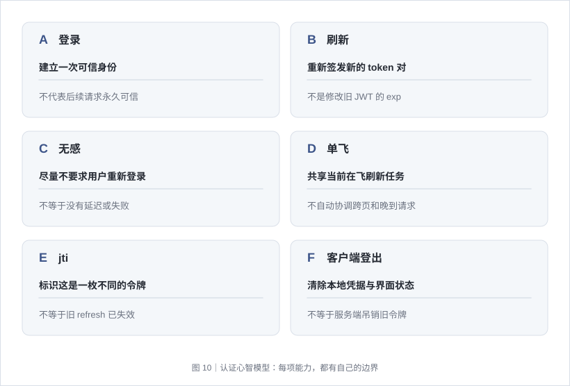

# 用户登录与认证（JWT）· 从登录到无感续期

> 登录不是一次“检查密码”的请求，而是一段会话的起点。本文围绕双 token 认证，解释身份如何建立、访问令牌过期后如何刷新，以及怎样避免并发刷新、无限重试和错误的安全假设。

## 一、先理解：登录成功之后，系统如何记住你



用户名和密码只应在登录时提交。登录成功后，服务端签发凭据；后续请求携带凭据，证明“我是刚才认证过的用户”，而不是反复传递密码。

常见方案有两类：

| 方案 | 后续请求携带什么 | 服务端如何确认身份 |
| --- | --- | --- |
| Session + Cookie | 浏览器自动携带会话 Cookie | 查询服务端会话记录 |
| Bearer token | 客户端主动设置 Authorization 请求头 | 校验令牌；JWT 可在验证签名和声明后提取身份 |

JWT 并不天然优于 Session。Session 便于集中管理会话；JWT 适合需要独立验签的访问链路，但即时撤销和身份信息更新需要额外设计。

本文采用一种容易理解的基线：**短效 access token + 长效 refresh token、请求头携带访问凭据、收到认证失败后按需刷新**。访问令牌校验可以无状态；是否增加会话存储，要根据吊销和安全要求决定。

核心链路是：

**注册或登录 → 保存双 token → 携带 access 访问资源 → access 失效 → 使用 refresh 换取新的一对 → 重试原请求 → 恢复正常交互。**

## 二、职责如何划分



不论采用什么技术栈，都应区分以下职责：

| 职责 | 需要做什么 | 不应该做什么 |
| --- | --- | --- |
| 页面 | 收集输入、展示业务结果、提示错误 | 每个页面分别实现刷新逻辑 |
| 请求层 | 注入 access、识别认证失败、协调刷新与重试 | 把所有失败都当作 token 过期 |
| 鉴权入口 | 验证访问令牌，生成本次请求的身份上下文 | 在身份无效时继续执行业务写操作 |
| 认证服务 | 校验登录信息，签发令牌，验证刷新凭据 | 把 access 当作 refresh 使用 |
| 用户或会话存储 | 保存密码哈希、用户状态；按需记录可撤销会话 | 保存明文密码，或把敏感字段放入 JWT |

**刷新入口不要求有效 access，并不意味着刷新无需认证。** 它使用请求体中的 refresh token 作为凭据，否则 access 一旦过期，用户连刷新接口也无法访问，续期链路就无法成立。

## 三、为什么要分成两个 token



上图先区分两种凭据的用途：access 到期不等于定时任务立即执行，按需方案要等业务请求遇到认证失败后才尝试续期。完整请求时序见第四章；失败策略与轮换边界见第六章。

| 凭据 | access token | refresh token |
| --- | --- | --- |
| 主要用途 | 访问受保护业务接口 | 换取新的令牌 |
| 常见有效期示例 | 30 分钟 | 7 天 |
| 发送位置 | `Authorization: Bearer ...` | 刷新请求体；也可采用受保护 Cookie 方案 |
| 使用频率 | 每次受保护请求 | 只有需要续期时 |
| 身份类型 | `type=access` | `type=refresh` |
| 泄露后果 | 攻击者可在有效期内访问资源 | 攻击者可能持续换出新的访问令牌，需更严格保护 |

两个令牌不是“长短不同但随便互换的字符串”。签名相同也不代表用途相同：业务接口只能接受 access；刷新接口只能接受 refresh。

**刷新不是修改旧 JWT 的过期时间。** JWT 的内容参与签名，不能原地延长；服务端必须重新生成载荷、过期时间和签名，签发一个新 token。

两种常见触发方式：

- **按需刷新**：先请求业务接口，收到认证失败后刷新，再重试。这是本文重点说明的方式。
- **提前刷新**：根据剩余有效期，在接近过期时主动刷新。它能减少一次失败请求，但要处理时钟偏差、后台标签页定时器节流和多端协调。

按需刷新**不是固定每 30 分钟运行一次定时任务**。用户即使离开页面一小时，只要期间没有请求，就不会仅因为时间到了而自动刷新；恢复操作时才进入续期流程。

## 四、一次自动刷新，究竟发生了什么



从上往下阅读：实线箭头是请求或响应，竖向虚线是各参与方的时间线。A0/R0 表示旧令牌，A1/R1 表示新令牌；图中是刷新成功主路径，并在末尾标出重试上限。

### 4.1 什么时候进入刷新分支

先区分两个容易混淆的“401”：

```http
HTTP/1.1 200 OK
Content-Type: application/json

{"code":401,"msg":"登录凭据已失效","data":null}
```

这里 **HTTP 状态是 200，响应体的业务码是 401**。客户端如果按照业务码约定处理，刷新逻辑必须位于响应内容处理分支。

另一种约定直接返回 HTTP 401。Axios 默认把非 2xx 交给错误分支，不能只写一个检查 `body.code` 的成功回调，然后认为 HTTP 401 也会得到相同处理。两种约定都可行，关键是明确采用哪一种，并分别测试。

采用业务码方式时，一次自动刷新通常至少需要同时满足：

1. 响应体 `code` 是数字 `401`。
2. 这次原请求还没有完成过自动刷新重试。
3. 客户端仍有 refresh token。

这些条件判断的是“可以尝试续期”，并没有证明失败原因一定是过期。缺失凭据、伪造凭据或其他认证失败，也可能使用同一业务码。更严格的实现可使用明确的错误分类和接口排除规则，避免错误密码等登录失败触发刷新。

### 4.2 按时间顺序走完一遍

假设客户端保存 `A0`（access）和 `R0`（refresh）。下面的时刻与编号仅为教学示例。

| 步骤 | 客户端 | 服务端 |
| --- | --- | --- |
| 1. 登录成功 | 保存 A0、R0 | 签发 access 有效 30 分钟、refresh 有效 7 天 |
| 2. 正常访问 | 业务请求携带 A0 | 验签、检查类型与过期时间，通过后执行业务 |
| 3. A0 到期 | 再次携带 A0 发出请求 | 在鉴权入口拒绝，返回业务 401，不执行受保护业务 |
| 4. 准备续期 | 保留原请求配置，暂不向页面交付失败结果 | 等待刷新请求 |
| 5. 请求刷新 | 单独发送 R0，不使用 A0 作为刷新凭据 | 校验 R0 的签名、过期时间与 refresh 类型 |
| 6. 签发新对 | 等待刷新结果 | 生成 A1、R1，各自拥有新的 exp 和 jti |
| 7. 更新凭据 | 先保存 A1、R1，再解除等待 | 返回新令牌对 |
| 8. 重试原请求 | 标记已重试，用 A1 替换旧请求头并重新发送 | 用 A1 鉴权，通过后执行原业务 |
| 9. 交付结果 | 把最终业务结果返回给原调用者 | 正常响应 |

“挂起原请求”并不是让原来的 HTTP 连接在服务端一直等待。**原 HTTP 请求已经收到 401；等待的是客户端 Promise 链。** 客户端保留请求参数，刷新结束后新发一条等价的业务请求。

对页面而言，原调用仍在等待：刷新成功时得到正常结果，通常无需切换到登录页，所以称为“无感”。它不代表没有额外请求，也不代表没有增加延迟。

### 4.3 刷新接口收到什么、验证什么

示例刷新请求如下，省略部署路径前缀：

```http
POST /auth/refresh
Content-Type: application/json

{"refreshToken":"R0（示意值，不是真实令牌）"}
```

不需要再次提交用户名和密码，也不需要有效 access。服务端至少执行：

1. 检查请求字段存在、非空。
2. 解析签名 JWT，使用受信密钥和允许的算法验证签名。
3. 校验过期时间 `exp`；有 `nbf` 时按策略校验生效时间。
4. 检查 `type=refresh`，不能只验证“签名是真的”。
5. 读取可信身份声明，例如 `sub` 中的用户 ID。
6. 根据系统设计检查用户/会话状态，或者明确采用无状态的简化路径。
7. 重新签发 access 与 refresh，返回新的令牌对。

**验签通过是否还查数据库，是一个设计选择。** 简化无状态方案可以直接读取令牌声明再签发，不必查库；代价是禁用用户、删除账户、修改昵称等变更不一定在刷新时立即生效。需要即时管控时，应查询用户或会话记录，而不是把旧声明永远当成最新状态。

示例成功响应：

```json
{
  "code": 200,
  "msg": "成功",
  "data": {
    "accessToken": "A1（示意值）",
    "refreshToken": "R1（示意值）",
    "tokenType": "Bearer",
    "accessExpiresIn": 1800,
    "userId": 42,
    "username": "reader",
    "nickname": "reader"
  }
}
```

`accessExpiresIn` 的单位是秒，表示签发时的有效期，不是不断更新的剩余时间。若响应不提供 `refreshExpiresIn`，客户端不能假定它存在。用户资料也不一定在刷新时重新查询，不能仅凭返回了 nickname 就认为资料已实时同步。

### 4.4 前端为什么要用独立的刷新通道

假如刷新接口也走相同的“401 就刷新”拦截器，会发生：

**刷新请求失败 → 再次刷新 → 再次失败 → 不断刷新。**

另一个风险是：刷新请求等待正在进行的刷新 Promise，而那个 Promise 恰好就是它自己，形成相互等待。

解决方法是把刷新放在**不包含自动刷新拦截器的独立请求客户端**中，或者明确跳过刷新接口。这个通道仍应配置超时、解析业务结果，但不能递归进入续期流程。

下面是“共享刷新任务”的教学核心片段；省略具体存储封装和页面行为，不是完整认证实现：

```javascript
let refreshInFlight = null

function obtainFreshTokens() {
  if (!refreshInFlight) {
    refreshInFlight = refreshClient
      .post('/auth/refresh', { refreshToken: readRefreshToken() })
      .then(({ data: body }) => {
        if (body.code !== 200 || !body.data?.accessToken) {
          throw new Error('刷新失败')
        }
        saveTokenPair(body.data)
        return body.data
      })
      .finally(() => {
        refreshInFlight = null
      })
  }
  return refreshInFlight
}
```

顺序很重要：**先保存新凭据，再让等待者继续。** 这样后续普通请求从存储读取时才能使用新 access。若接口约定每次都返回新 refresh，还应检查令牌对完整性；不能在服务端漏字段时悄悄丢失续期能力。

### 4.5 原请求如何恢复，为什么只能重试一次

客户端保留的是原请求配置：URL、方法、参数、请求体和必要头部。刷新成功后：

- 在配置中记录“已经自动重试”。
- 把 Authorization 改成新 access，不能携带旧头部原样再发。
- 通过同一个业务请求客户端重发，使正常响应仍被统一解包。
- 将重发结果作为原 Promise 链的最终结果，交回页面。

```javascript
if (body.code === 401 && !requestConfig.retried && readRefreshToken()) {
  try {
    await obtainFreshTokens()
  } catch {
    clearLocalTokens()
    redirectToLoginWithCurrentPage()
    throw new Error('登录已过期，请重新登录')
  }

  requestConfig.retried = true
  requestConfig.headers.Authorization = `Bearer ${readAccessToken()}`
  return apiClient.request(requestConfig)
}
```

此处把“刷新失败”和“重发后的业务失败”分开：**刷新成功不保证业务一定成功**。例如权限不足、数据校验失败或重发再次 401，应作为该业务请求的结果处理，而不是无限循环刷新。

认证重试也不是任意网络重试。安全重放的前提是第一次请求确实在鉴权入口被拒绝，业务尚未执行；对于可能已产生副作用的写请求，还需要幂等键或服务端去重，不能因“没收到成功响应”就断定“没有执行”。

## 五、并发请求为什么不会一起刷新



图中的汇合只表示“等待同一次刷新”，不是把多个业务请求合成一个响应。刷新成功后各自恢复；刷新失败则各自得到错误。

### 5.1 单飞：共享一个刷新任务，各自重发自己的请求

一个页面可能同时请求用户资料、订单和通知。如果 A0 都已经失效，三条请求可能接连返回 401。每条都单独刷新，会造成重复网络请求，还可能出现不同刷新结果互相覆盖。

**单飞（single-flight）**的含义是：在一个刷新任务仍在进行期间，同一客户端实例的其他请求等待同一个结果，而不是各自再发刷新。

| 时间顺序 | 用户资料请求 P | 订单请求 Q | 通知请求 S |
| --- | --- | --- | --- |
| 都携带 A0 | 收到业务 401 | 尚未返回 | 尚未返回 |
| 首个请求进入 | 创建刷新任务 F | 收到 401，等待 F | 收到 401，等待 F |
| F 完成 | 新令牌对已保存 | 获取同一个刷新结果 | 获取同一个刷新结果 |
| 各自恢复 | 使用 A1 重发 P | 使用 A1 重发 Q | 使用 A1 重发 S |

这里没有必要手工维护一个“HTTP 请求队列”。**共享 Promise 就可以协调等待者**，原配置仍分别保存在各个请求自己的处理链中。共享的是刷新任务，不是三个业务请求的响应。

刷新失败时，等待者也都会收到失败，而不是永久挂起。登录跳转应避免重复弹窗或多次导航。

### 5.2 单飞不等于整批请求永远只刷新一次

共享变量在刷新完成或失败后清空，目的是允许下一次真正需要续期时重新刷新。它只覆盖刷新任务在飞的时间，不覆盖所有旧请求的完整生命周期。

例如：P 已经完成刷新、共享变量已清空，使用旧 A0 发出的 Q 才迟迟返回 401。若处理器只检查“有没有刷新任务”，Q 仍可能触发下一次刷新。

改进方向是先比较：**失败请求携带的 access 是否还是当前 access？** 如果当前凭据已经更新，可以先用最新 access 重试一次，不必再次刷新；仍须保留重试上限。

另外，模块级变量只协调当前 JavaScript 运行环境，不会自动协调多个浏览器标签页。跨页单飞需要额外通信/锁及会话版本约束。

### 5.3 刷新与退出登录也存在竞态

可能出现这样的顺序：用户发起刷新 → 点击退出并清除凭据 → 刷新响应晚到 → 旧会话凭据又被写回。

仅清空本地存储不足以阻止已在飞请求提交结果。更健壮的方案应在登出或切换账号时提升会话版本、取消可取消请求，并在保存刷新结果前确认它仍属于当前会话。

这属于需要显式实现的保护，**不会因为使用了 Promise 或 localStorage 就自动获得**。

## 六、刷新失败、令牌轮换与会话边界



左右两种方案的关键差别，不是是否返回新 token，而是服务端是否原子记录旧 refresh 已被消费。图下方提醒：网络故障与凭据无效需要分开理解。

### 6.1 不同失败，不应混为一谈

下表描述“业务 401 + 单次重试”的处理边界：

| 情况 | 自动刷新分支是否触发 | 应理解为什么 |
| --- | --- | --- |
| 业务 401，尚未重试且有 refresh | 可以尝试 | 身份失败具备续期条件，不代表必定成功 |
| 业务 401，但没有 refresh | 不触发 | 普通错误分支与路由守卫仍需决定如何引导登录 |
| 刷新凭据过期、签名错误或类型错误 | 刷新失败 | 不能续期，需要重新建立身份 |
| 刷新网络超时或服务故障 | 刷新失败 | 不证明凭据本身无效；需考虑可恢复故障策略 |
| 重发后再次业务 401 | 不再自动刷新 | 重试上限防止循环，将失败交给调用者 |
| 真正的 HTTP 401 | 取决于 HTTP 错误分支是否接入 | 不能依赖仅检查响应体的处理器 |

一种简单策略是“刷新失败统一清凭据并跳登录”，实现容易理解，但网络抖动也会使用户退出。更成熟的系统通常区分凭据无效与临时故障，决定提示重试、短暂等待或重新登录，且不能保留无限等待状态。

登录回跳应保存**用户当前页面地址**，不是失败 API 地址；只接受受控的站内地址，避免任意外部跳转。凭据存储、内存中的用户资料和页面显示也是不同状态，必须有明确的同步和清理规则。

### 6.2 发出新 refresh，不代表旧 refresh 已失效

需要严格区分两种设计：

| 设计 | 刷新后旧 R0 是否还能使用 | 需要什么 |
| --- | --- | --- |
| 仅签发新的一对 JWT | 没有撤销机制时，R0 可重复使用直到自身过期 | 验签、类型与时间校验 |
| 严格的一次性 refresh 轮换 | 成功使用 R0 后立即作废，重用应被检测 | 服务端会话记录、原子消费/轮换及重用处理 |

因此不能把“旋转双发”理解为“旧 refresh 还能用一次”，也不能把它等同于 OAuth 风格的 refresh token 重用检测。**新 token 的 jti 不同，只能说明它是新的凭据，不代表旧凭据已经被撤销。**

同理，仅在客户端登出并清除 token，不会让已经签发的 JWT 在其他地方立即失效；仍需等待过期或依赖服务端吊销。

### 6.3 7 天有效期不一定是会话总寿命

若每次刷新都从当前时刻重新签发一个有效 7 天的 refresh，持续活跃的用户可能一直续期。这是滑动有效期，不是“从第一次登录开始，最多只能用 7 天”。

如果业务要求绝对会话期限，应记录初次认证时间或会话终止时间，并在刷新时验证。高风险操作还可要求重新输入密码或二次认证，而不只依赖长期持有的 refresh。

## 七、JWT 验签、数据模型与接口契约

### 7.1 JWT 中有哪些声明



JWT 通常形如 `header.payload.signature`。头部和载荷采用 Base64URL 编码，**不是加密**；签名提供完整性与来源校验，但不隐藏内容。

| 声明 | 含义 | 校验或使用要点 |
| --- | --- | --- |
| sub | 用户唯一标识 | 验签后再读取身份 |
| type | access / refresh | 防止用途混用 |
| exp | 过期时间 | 服务端按可信时间校验，可设有限时钟容差 |
| iat | 签发时间 | 不等于“自动完成有效期验证”，额外时间策略需显式设置 |
| jti | 令牌唯一 ID | 可用随机值区分同秒签发，撤销/消费还需要存储支持 |
| iss / aud | 签发方与受众 | 多服务、多客户端场景按契约检查，不是加了字段就自动生效 |

HS256 使用对称密钥，需足够强度并妥善管理；RS256 使用私钥签名、公钥验证，适合隔离签发权与验签权。无论选择哪种，都不能盲目信任令牌头部要求的算法。

签名验证不需要每次查询会话，但业务本身仍可能查询用户或权限。不要把“JWT 无状态验签”误解为“整个请求都不需要数据库”。

### 7.2 最小数据模型与可撤销会话

| 数据 | 最小认证需要什么 | 增强能力 |
| --- | --- | --- |
| 用户 | ID、唯一登录名、密码哈希、展示资料 | 账户启停、安全版本、二次认证 |
| 刷新会话 | 简化无状态方案可以不保存 | 保存 token 哈希/会话 ID、到期、撤销、令牌家族与轮换关系 |
| 幂等记录 | 只读身份查询通常不需要 | 对可重试写操作保留请求幂等标识 |

密码使用 BCrypt、Argon2 等适当的密码哈希方案；数据库唯一约束兜底并发重名。刷新凭据如果需要落库，优先保存可验证的哈希或标识，不在日志中记录原文。

### 7.3 示例接口

表中失败码为响应体业务码；路径省略部署前缀。

| 接口 | 凭据 | 成功语义 | 失败示例 |
| --- | --- | --- | --- |
| POST /auth/register | 注册信息 | 注册即登录，返回 token 对 | 重名 409；参数非法 417 |
| POST /auth/login | 用户名、密码 | 签发 access 与 refresh | 统一 401，不区分账号不存在与密码错误 |
| POST /auth/refresh | 请求体 refreshToken | 校验后签发新 token 对 | 缺字段属于参数错误；过期/无效/类型不符 401 |
| GET /user/me | Bearer access | 返回当前用户信息 | 缺失/过期/伪造凭据 401 |

“刷新免 access 鉴权”和“刷新必须验证 refresh 凭据”要同时成立。

## 八、安全取舍：简化方案能做什么，不能做什么



两种存放方式改变的是凭据被读取和被附带的方式，不是消除全部风险。选择一种之后，仍需完成相应的 XSS、CSRF 和会话保护。

| 议题 | 简化选择 | 必须知道的边界 |
| --- | --- | --- |
| 凭据存放 | localStorage + 主动请求头 | 浏览器不会自动跨站附带该头，但 XSS 可读取令牌；并非绝对免疫所有攻击 |
| Cookie 方案 | HttpOnly、Secure、适当 SameSite | 减少脚本直接读取，但仍需 CSRF 防护、来源约束和刷新链路设计 |
| 刷新不查库 | 从可信声明直接重签 | 用户禁用、删除、资料变更不一定立即阻止续期 |
| 无撤销记录 | 依赖 JWT 过期 | 旧 refresh 可重复使用、客户端登出不能远程吊销 |
| 统一业务 401 | 前端逻辑集中 | 可能混淆过期、错误密码和其他认证失败 |
| 通用配置重放 | 复用原 URL、方法、参数 | 写操作需确认首次没有执行或具备幂等保障 |
| 单飞 Promise | 一个客户端实例共享在飞刷新 | 不覆盖晚到响应、跨页协调和账号切换竞态 |

其他基本要求：全链路 HTTPS；不把 token 放入 URL；日志不落密码/令牌原文；配置强密钥与轮换策略；对登录和刷新限流；对敏感业务设置重新认证门槛。

这些措施是独立能力，不能仅因为使用了 JWT 就认为已经具备。

## 九、怎样验证刷新真的按预期工作



上半部分用于对照正常请求顺序，下半部分是必须单独构造的边界条件；图示是测试设计，不代表已经执行或通过。

以下是测试设计，不是已经执行的实测结果。应在隔离测试环境使用短有效期和测试账号，避免为观察续期修改生产参数。

| 验证场景 | 操作方式 | 需要观察的结果 |
| --- | --- | --- |
| 正常访问 | 在 access 有效期内请求 | 无刷新请求，业务正常返回 |
| 单次过期 | 等 access 到期后访问 | 业务 401 → 一次 refresh → 原接口重试 → 成功 |
| 暂无操作 | access 到期期间不请求 | 按需方案不会自行启动定时刷新 |
| 并发过期 | 同时发出多条受保护请求 | 刷新在飞期间共用一次任务，之后各自重试 |
| 晚到 401 | 延迟一条旧 token 请求的响应 | 明确是否会再次刷新，不把单飞能力夸大 |
| refresh 失效 | 使用过期或无效 refresh | 无递归刷新，用户收到可理解反馈 |
| 类型混用 | access 发给刷新接口 | 拒绝，不能仅凭签名正确就通过 |
| 重试仍失败 | 让重试返回业务 401 | 不再刷新，不无限重放 |
| HTTP/业务码区别 | 分别返回 HTTP 401 与 HTTP 200/code=401 | 两条响应分支符合约定 |
| 旧 refresh 重用 | 换新后再次提交旧 refresh | 简化无状态方案仍可能成功；严格轮换应拒绝，二者不能混测 |
| 退出竞态 | 刷新在飞时退出或换账号 | 验证是否阻止旧结果污染新会话 |
| 写请求 | 在鉴权拒绝和未知执行结果下分别重试 | 验证业务没有重复副作用 |
| 回跳 | 刷新失败后重新登录 | 回到受控的原页面，不跳转失败 API 或外部站点 |

浏览器 Network 面板中最值得关注的不是“token 变没变”，而是请求顺序和凭据用途：

1. 首条业务请求携带旧 access，返回业务 401。
2. 刷新请求体使用 refresh，不重新发送密码。
3. 刷新响应返回新的一对令牌。
4. 原业务请求再次出现，并使用新 access。
5. 页面最终拿到业务结果，后续请求不再携带旧 access。

检查时避免把完整令牌复制到截图、工单或日志中。

## 十、把几个常见误解一次讲清



- **刷新会向用户再要密码吗？** 通常不会，refresh 是续期凭据；失效或敏感操作需要重新认证时才要求用户参与。
- **access 过期就必须立刻退出吗？** 不必，只要 refresh 有效且系统允许该会话续期，就可以恢复访问。
- **刷新会修改旧 access 吗？** 不会，是签发并保存新令牌，再用它重发请求。
- **多个失败请求共用的是什么？** 同一次刷新任务；每条业务请求仍独立发送和返回。
- **有 jti 就能防止旧 refresh 重用吗？** 不能，还需服务端记录并原子校验/消费。
- **单飞就没有竞态了吗？** 没有，它不能自动解决晚到 401、跨标签页和登出期间的在飞结果。
- **无感续期等于永不掉线吗？** 不等于，续期存在凭据、网络、会话策略等边界，失败路径同样是设计的一部分。

继续深入时，可以分别研究：严格 refresh 轮换与重用检测、可撤销会话、绝对会话期限、多端登录管理、SSO/OIDC、HttpOnly Cookie 与 CSRF 防护，以及敏感操作的再次认证。
