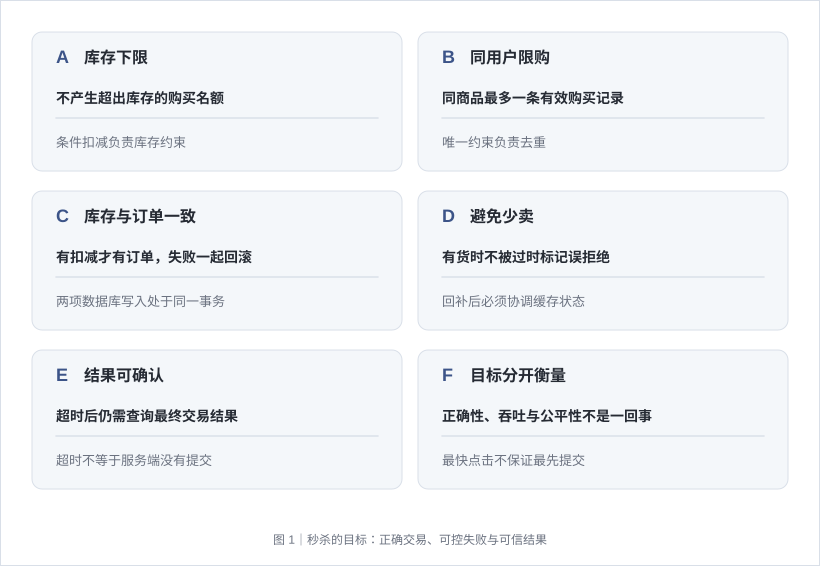
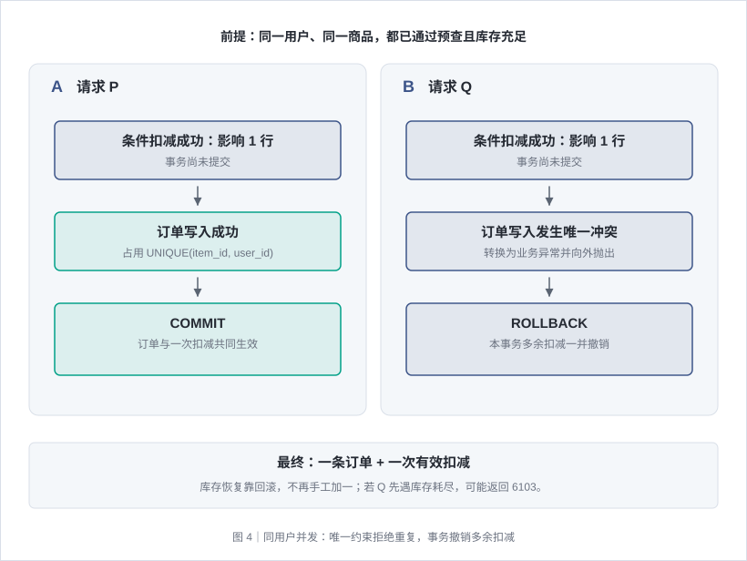
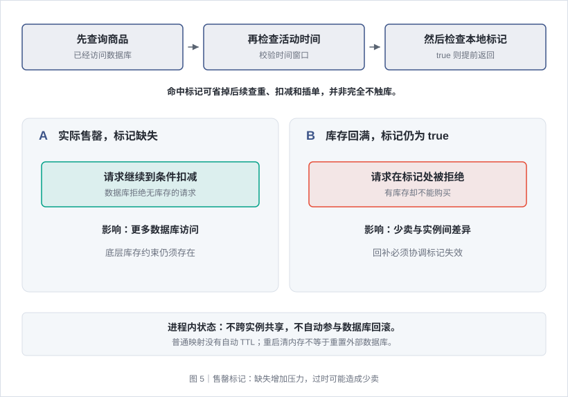
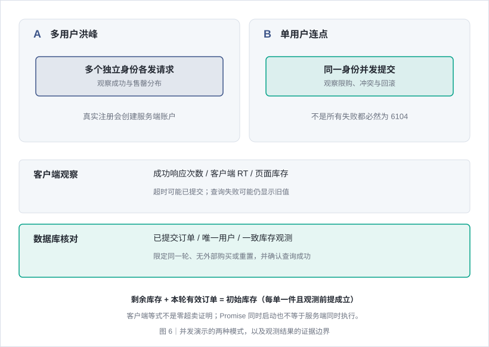
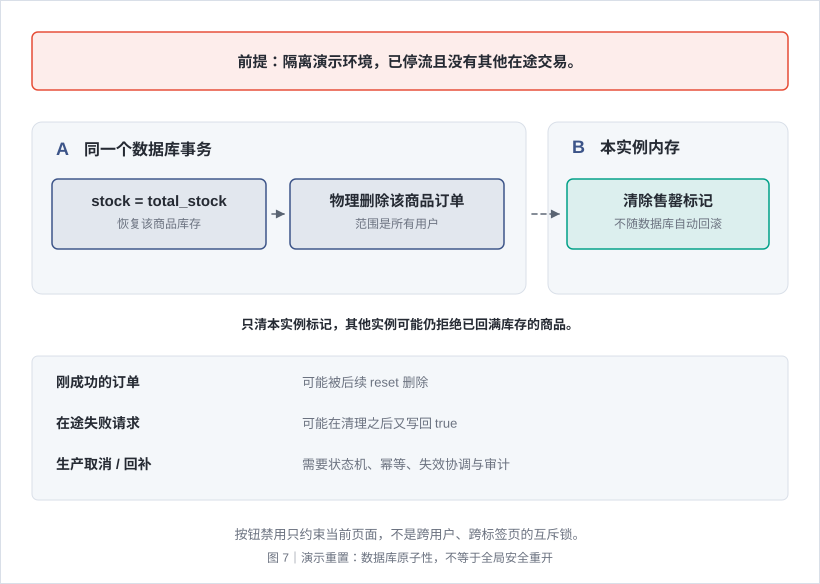
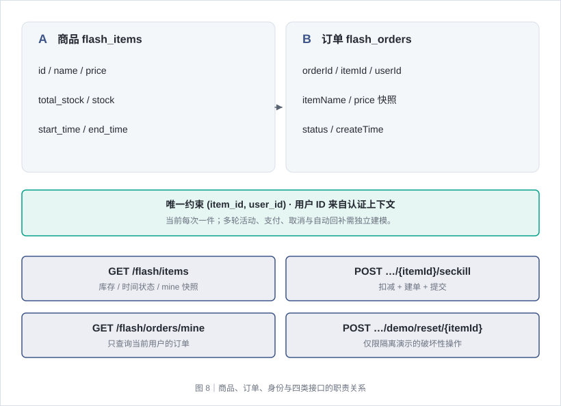
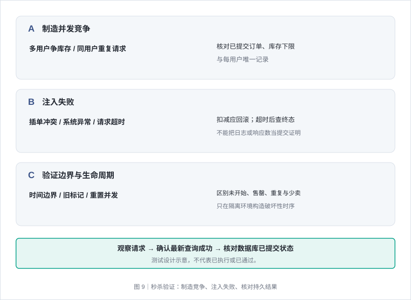

# 秒杀抢购 · 从一次点击到库存与订单一致

> 秒杀不只是“把下单接口做快”。真正的难点是：许多用户同时争抢少量库存时，如何不超卖、不重复下单、不留下孤立扣减，并让失败请求以可控成本退出。本文先讲清同步数据库方案，再说明性能优化和实验结果的边界。

## 一、先明确：秒杀究竟要保证什么



有限库存遇到瞬时并发，大部分请求没有机会成功。系统的目标不是让所有请求都下单，而是**在约束内产生正确订单，并清楚地拒绝其余请求**。

| 问题 | 错误现象 | 需要的保障 |
| --- | --- | --- |
| 超卖 | 可售库存只有 5 件，却产生 6 个有效购买名额 | 扣减不能越过库存下限 |
| 重复购买 | 同一用户对同一商品拿到多件 | 用户与商品维度的唯一性 |
| 孤立扣减 | 库存少了一件，但没有对应订单 | 扣减与建单同成同败 |
| 孤立订单 | 订单生成，但没有消耗库存 | 相同事务的一致性 |
| 少卖 | 库存还有，却被过时售罄状态拒绝 | 优化状态与真实库存不能长期背离 |
| 请求结果不确定 | 页面超时，但服务端可能已经提交 | 查询结果、幂等与可观测性 |

本文采用的基线是：每次购买一件、每个商品每人限购一件、下单即扣库存；订单只表示“已抢购”，不引入支付、取消和超时回补。

它不承诺先点击的人一定先成功，也不承诺不会排队等待。**正确性、吞吐量、公平性和用户体验是不同目标**，需要分别设计。

核心链路：**查看列表 → 发起抢购 → 身份与活动校验 → 条件扣库存 → 插入订单 → 提交事务 → 查询结果。**

## 二、一次抢购是怎样执行的


沿中间箭头向下阅读成功主路径，右侧是各步骤可能返回的业务错误。大框标出事务方法范围，但内存标记不属于数据库的自动回滚对象。

### 2.1 页面显示的是快照，不是预留名额

列表通常返回商品、价格、总库存、剩余库存、活动时间、时间状态和当前用户是否已经购买。

这里有两个独立维度：

- **时间状态**：未开始、进行中、已结束。
- **交易状态**：剩余库存是否为零、当前用户是否已购买。

因此，“进行中”与“已售罄”并不矛盾：活动还在时间窗口内，但库存已经卖完。`mine=true` 表示查到了当前用户订单，不表示活动结束。

定时拉取列表只能展示查询时刻的状态。用户看到“还剩 1 件”时，这件商品可能已经被别的请求买走。前端禁用按钮、显示倒计时和限制连点，只能改善交互，**服务端必须重新判断**。

列表若分别查询订单集合与商品数据，也不能被描述为自动具备同一数据库快照；展示上的短暂差异不等于交易约束已经失效。

### 2.2 按执行顺序走完一次请求

下面是一种同步事务方案的具体顺序，商品查询在本地售罄标记检查之前：

| 步骤 | 执行内容 | 失败时发生什么 |
| --- | --- | --- |
| 1. 验证身份 | 从受保护请求中取得可信用户 ID | 无有效凭据则拒绝，不进入业务写入 |
| 2. 进入事务 | 建立后续数据库操作的事务边界 | 异常不得被吞成正常结果 |
| 3. 读取商品 | 判断商品是否存在，取得时间、名称和价格 | 不存在则返回 404 |
| 4. 检查活动时间 | 与服务端当前时间比较 | 未开始 6101，已结束 6102 |
| 5. 检查售罄标记 | 读取本实例该商品的快速失败标记 | 已标记则返回 6103 |
| 6. 预查已有订单 | 查询该用户是否已买过该商品 | 查到则返回 6104 |
| 7. 条件扣减 | 执行一条带 `stock > 0` 的 UPDATE | 影响 0 行则标记售罄并返回 6103 |
| 8. 写入订单 | 固定数量一件，保存购买人和商品快照 | 唯一冲突或系统异常使事务回滚 |
| 9. 提交事务 | 库存变化和订单一起生效 | 提交失败不能作为成功订单返回 |
| 10. 展示结果 | 返回订单信息，前端刷新列表与订单 | 网络异常可能使客户端不知道最终结果 |

**查询、时间判断、内存标记和数据库写入不是“一条原子操作”。** 同一事务保护的是参与该事务的数据库效果；应用内存状态不会因此自动获得数据库回滚能力。

### 2.3 时间判断的边界要写清楚

如果采用“早于开始时间拒绝、晚于结束时间拒绝”的规则，那么恰好等于开始或结束时间都属于活动窗口。它与常见的左闭右开 `[start, end)` 约定不同，没有绝对正确的一种，但必须明确。

时间校验如果只执行一次，而扣减 SQL 不包含活动时间条件，就可能出现：检查时尚未结束 → 等待数据库锁 → 活动结束后才完成扣减或提交。

这类方案保证的是“进入该步骤时允许抢购”，不是“提交时仍必须在活动期”。如果业务要求严格截止，应把时间判定位置、可信时钟和数据库约束一起设计，不能依赖页面倒计时。

## 三、防超卖的核心：把判断与扣减放在一起

### 3.1 为什么先查库存再无条件扣减不可靠


图中假设商品存在、库存初始为 1、没有其他写入，且成功分支后续订单写入和事务提交都完成。下面分别拆解库存竞争与订单事务，避免把“扣减成功”直接当成“整笔交易已成功”。

容易出错的写法：

```sql
-- 请求 P 与请求 Q 都可能查到 1。
SELECT stock FROM flash_items WHERE id = 1;

-- 应用判断刚才的值大于 0，然后无条件扣减。
UPDATE flash_items
SET stock = stock - 1
WHERE id = 1;
```

可能发生的时序：

| 时刻 | 请求 P | 请求 Q | 数据库库存 |
| --- | --- | --- | --- |
| t1 | 读到 1 | 尚未读取 | 1 |
| t2 | 准备扣减 | 也读到 1 | 1 |
| t3 | 无条件减一并提交 | 准备扣减 | 0 |
| t4 | 已结束 | 仍执行无条件减一 | -1 |

数据库即使按顺序执行两个 UPDATE，也无法补上应用漏写的库存条件。仅仅把 SELECT 和 UPDATE 放进一个普通事务，**不等于已经把“读到的值”锁定为之后的事实**；额外锁定、隔离策略或原子谓词才可能改变结果。

### 3.2 正确读取条件 UPDATE 的含义

把库存条件放入写语句：

```sql
UPDATE flash_items
SET stock = stock - 1,
    update_time = CURRENT_TIMESTAMP
WHERE id = :item_id
  AND stock > 0
  AND deleted = 0;
```

`:item_id` 表示绑定参数，不是字符串拼接。主键定位至多一行，客户端应读取受影响行数：

- **1 行**：本条语句成功扣减一件，可以继续插入订单；此时事务可能尚未提交。
- **0 行**：没有行满足全部条件，本次没有扣减；不能继续建单。
- **抛出异常**：例如死锁、超时或连接故障，不等同于库存不足，也不能伪装成成功。

“影响 0 行”等价于**没有满足谓词的记录**，并不严格等价于“库存刚好为 0”。商品不存在、被删除或库存非正，都可能造成 0；前置查询也无法排除查询之后发生的变化。

### 3.3 原子 UPDATE 不是无锁算法

条件判断和减一由数据库在同一个写操作中协调，避免使用过时的应用层读取结果决定能否扣减。但多个事务争抢同一行时，仍可能发生写锁等待、死锁检测或隔离级别相关的冲突。

因此不能说“用了原子 UPDATE 就没有锁”，也不能说“UPDATE 执行完就立即释放所有锁”。事务通常还要继续写订单，相关写锁的释放取决于数据库和事务完成时机。

与 `SELECT ... FOR UPDATE` 相比，条件 UPDATE 减少了显式先读再写的步骤；两者都必须控制事务长度。扣库存后不要在事务内等待支付、调用慢远程服务或做大批计算，否则同一热点行的等待会被放大。

## 四、一人一单和事务回滚如何配合



左右两列各表示一个请求内部的先后步骤，不表示它们同时完成每一行。图示选择“库存足够、两个请求都曾扣减成功”的分支；同一库存行仍可能让后到请求等待先到事务结束。

### 4.1 预先查重只是优化，唯一约束才是最终防线

即使先查询“该用户还没有订单”，同一用户的两个并发请求也可能同时查到不存在，然后都继续执行。

限购一件应有数据库唯一约束：

```sql
ALTER TABLE flash_orders
ADD CONSTRAINT uk_flash_orders_item_user
UNIQUE (item_id, user_id);
```

这是约束示例，不是重复执行的迁移脚本。

两个请求能否同时“看起来符合资格”并不重要，关键是数据库不允许最终保存两条同商品、同用户的订单。

此处“幂等”更准确地说是**避免重复订单副作用**。重复请求可能返回 6104，并不保证返回第一次创建的同一个成功订单；若需要相同请求始终返回相同结果，应进一步设计请求幂等键和结果查询。

### 4.2 为什么要先扣库存、再插订单、同一事务

假设库存充足，同一用户的请求 P、Q 都通过预查：

| 阶段 | 请求 P | 请求 Q |
| --- | --- | --- |
| 扣库存 | 扣一件 | 等待后也可能扣到一件 |
| 插订单 | 写入成功 | 与 P 的用户/商品唯一键冲突 |
| 事务结束 | 提交库存与订单 | 抛出异常，回滚自己的库存扣减 |

最终只应留下一个订单和一次有效扣减。**Q 的库存恢复由数据库事务回滚完成，不是再发一条“库存加一”补偿 SQL。**

教学用事务步骤如下：

```text
BEGIN
  查询商品并检查活动
  检查本地售罄状态与已有订单
  条件 UPDATE 扣一件库存
  如果影响行数为 0：标记快速失败，抛出售罄异常
  INSERT 订单
  如果插入发生唯一冲突：抛出重复购买异常
COMMIT

任意需要回滚的异常逃出事务边界：ROLLBACK
```

业务异常必须向事务边界传播，不能在内部捕获后直接返回正常对象。把数据库唯一冲突转换成可理解的业务错误没有问题，但转换后的异常仍需触发回滚。

“先插订单、再扣库存”也能设计成同事务方案；只是扣减失败时要回滚订单。顺序不是唯一正确性来源，**正确约束、异常传播与事务边界才是关键**。

### 4.3 数据库事务不能替你回滚所有东西

| 状态 | 是否能随该数据库事务回滚 |
| --- | --- |
| 同一事务内的库存 UPDATE 与订单 INSERT | 可以 |
| 已经修改的进程内售罄标记 | 不会自动回滚 |
| 已发送的消息或第三方请求 | 不会自动回滚，需额外一致性设计 |
| 已输出的日志 | 不会撤回；日志出现不等于提交成功 |

如果捕获所有“重复键异常”都返回限购，可能把其他唯一约束异常误分类。更严格的错误映射应识别约束语义，不把所有插单异常一律当成重复购买。

### 4.4 重复请求不一定都返回同一个错误码

错误顺序同样影响观察结果。在“时间 → 售罄标记 → 已有订单 → 扣减 → 插单”的顺序下：

| 状态 | 可能的响应 |
| --- | --- |
| 活动已结束，即使用户买过 | 6102 已结束 |
| 售罄标记已为 true，即使用户买过 | 6103 已售罄 |
| 尚未命中标记，但查到已有订单 | 6104 重复抢购 |
| 同用户并发通过查重，插单时发生唯一冲突 | 6104，回滚本次扣减 |
| 同用户并发通过查重，但库存先耗尽 | 6103，根本没有走到插单 |

因此单用户连续提交的正确目标是“最多一条有效订单、最多一次有效扣减”，而不是无条件要求“1 次成功，其他全部是 6104”。

## 五、本地售罄标记能优化什么



上方先说明标记在请求链中的位置，下方对比两种不同的失配。不要把“缺少优化”与“错误拒绝”当成同一类后果。

### 5.1 三层防线与事务各司其职

| 能力 | 主要职责 | 不能替代什么 |
| --- | --- | --- |
| 本地售罄标记 | 减少已知无机会请求的后续处理 | 不能保证库存正确或用户限购 |
| 数据库条件扣减 | 限制本次写入必须满足库存条件 | 不能独自保证每用户一单 |
| 数据库唯一约束 | 限制同商品同用户重复记录 | 不能独自保证库存不超扣 |
| 事务 | 让扣减与订单的数据库效果同成同败 | 不能自动同步各进程内存 |

不能仅因为存在某个优化层就跳过底层约束。反过来，数据库约束能保持交易安全，也不代表数据库能承受任意数量的请求。

### 5.2 什么时候设置标记，命中后省掉什么

一种简单做法是维护“商品 ID → 布尔值”的进程内并发安全映射：

- 初始无标记或为 false，继续走交易判断。
- 条件扣减返回 0 后，将该商品标记为已售罄。
- 后续命中 true，立即退出当前抢购流程。

**最后一件从 1 扣到 0 不一定立刻打标。** 如果标记只在失败扣减时设置，还要等后续某个请求扣减失败，才会成为 true。

标记在哪一步读取，决定节省什么。若商品查询与时间检查在它之前，命中标记仍然已经读过数据库；它省掉的是后续订单查重、扣减和插单，不能宣传为“所有售罄请求完全不触库”。

这里的常数时间查找也不是零成本，更不是覆盖整个接口吞吐量的保证。

### 5.3 缺标记与错标记的风险不同

| 情况 | 结果 | 主要影响 |
| --- | --- | --- |
| 实际售罄，但标记缺失 | 请求继续到数据库，被条件扣减拒绝 | 增加数据库压力 |
| 库存已恢复，但标记仍为 true | 请求过早被拒绝 | 有货却少卖 |
| 一个实例清标记，其他实例未清 | 不同实例可能返回不同结果 | 分布式状态不一致 |
| 标记只驻留内存，应用重启 | 标记消失 | 不等于外部数据库库存和订单被重置 |

只使用普通映射时，通常没有自动 TTL、活动结束清理或容量限制，必须按生命周期另行设计。

标记属于非事务资源：扣减失败后置 true，再抛出业务异常触发回滚，**数据库回滚不会把该 true 撤销**。这在无库存回补的单调消耗过程中容易理解，但一旦加入库存恢复或重开活动，就必须考虑标记失效顺序。

## 六、并发演示应该怎样观察



图中将“看到了哪些响应”与“数据库最终提交了什么”分开。两者应互相核对，不能仅凭一个页面等式替代持久结果验证。

### 6.1 多用户与单用户是两种不同实验

| 模式 | 发起方式 | 主要观察点 |
| --- | --- | --- |
| 多用户洪峰 | 准备多个独立身份，再各发一次抢购 | 库存竞争、成功与售罄分布 |
| 单用户连点 | 同一身份同时提交多次 | 查重竞态、唯一约束与回滚 |

多用户实验若真实调用注册接口，创建的是服务端账户，不是仅在浏览器生成几个名字。每个抢购必须携带自己的 token，不能被普通请求拦截器统一替换成当前登录用户凭据。

独立实验请求通道通常需要显式传入 Authorization；若没有接入自动续期，就不能假定它具备普通业务请求的 token 刷新能力。

可以先分批准备用户，再并发启动抢购，并添加少量随机起跑差模拟请求到达时间。**浏览器 Promise 同时启动不等于服务器同时执行**；浏览器连接、网络、线程池、数据库连接池和行锁都会重新排列实际时序。

### 6.2 如何读懂请求日志与耗时

- 每条日志应区分业务成功、售罄、重复购买、其他业务错误和网络异常。
- 请求日志可以逐条追加，聚合统计也可以在全部请求结束后一次生成；两者不要都笼统称为“实时统计”。
- 客户端 RT 包含发起到收到响应的往返等待，不是纯服务端执行时间，也不能直接推断行锁等待长度。
- 若总耗时从注册前开始计算，它还包含账号准备和起跑等待；与只计算抢购接口耗时的指标不可直接对比。
- 日志展示可以设置上限，但统计不能因为 UI 截断而丢失结果。
- 客户端超时只说明“规定时间内没拿到结果”，不保证服务端事务已回滚。

### 6.3 库存等式何时成立

在初始库存有效、每单一件、只考虑该轮已提交成功订单、没有重置/回补/外部写入，且使用一致观测口径时，可以检查：

```text
剩余库存 + 该轮已提交的有效订单数 = 该轮初始库存
```

这是有前提的交易约束，不是任意时刻、任意两次独立查询都能直接得到相同数字。

页面常见的快速核对是：

```text
开跑前页面库存 - 本轮收到成功响应的次数
是否等于
结束后最新查询的库存
```

二者**不是同一个证据等级**。页面核对可能被以下情况影响：

- 开跑前库存已过时，准备账号期间有其他购买。
- 有外部用户抢购、其他标签页重置或人工改库存。
- 服务端已提交，但成功响应丢失或客户端超时，页面少记成功数。
- 结束后的刷新失败，页面保留旧值，却误称“服务端最新剩余”。

真正的数据库核对还需检查订单条数、唯一用户、库存变化与事务提交结果。前端等式成立是有用的观察，**不是独立的零超卖证明**；不成立也应先排查观测口径，不要立刻断定算法超卖。

多用户实验中的虚拟用户订单，也不会自然出现在“当前登录用户的订单”里。

## 七、库存重置为什么只能用于隔离演示



库存恢复与订单删除可以属于同一个数据库事务；右侧本实例标记清理却不会自动随它回滚。虚线表示跨资源协调，不意味着数据库已经先提交。

### 7.1 重置实际上做了什么

一个演示重置流程可能依次执行：

```text
确认商品存在且仍处于允许的活动窗口
BEGIN
  把剩余库存设为总库存
  物理删除该商品的所有订单
  清除当前实例的售罄标记
COMMIT
```

其中前两项数据库写入可放在同一事务；第三项仍是内存修改，不会因此成为数据库事务的一部分。

重置清空的是**这个商品所有用户的订单**，不只是虚拟用户或某一种订单状态。它通常不删除已注册账户、不撤销 token、不修改活动时间，也不重置其他商品。

为什么要物理删除？如果唯一键只是 `(item_id, user_id)`，将订单改成 `deleted=1` 不会释放这个组合。是否允许取消后再次购买，应明确设计约束和状态，而不是以为逻辑删除天然绕过唯一键。

### 7.2 同事务重置，不等于可以与抢购安全并发

没有停流和轮次隔离时，可能发生：

- 某用户刚收到购买成功，随后重置把他的订单删除。
- 失败扣减请求已经得到 0，但延迟设置 true；重置先清 false，旧请求又把 true 写回来。
- 一个实例回满库存并清标记，其他实例仍以 true 拒绝请求。
- 数据库事务最终回滚，内存标记却已经改变。

因此应在**无其他用户交易、无在途请求的隔离演示环境**中使用。前端禁用当前按钮只约束这一个页面，不能阻止其他页面、标签页或接口调用。

如果入口仅要求普通登录，那只是身份门槛，不是管理员授权。生产环境应移除演示入口，或设计专门权限、审计、停流和可恢复流程，不能靠名字含有“demo”保证安全。

### 7.3 生产库存回补需要另一套模型

真正的回补通常对应订单取消、支付超时、退款或仓储调整。需要明确：

- 哪个业务事件允许回补，是否只能执行一次。
- 订单状态转换和库存增量如何原子或最终一致。
- 谁负责清理/更新各级售罄状态。
- 活动批次如何隔离，旧请求是否仍能写入新一轮。
- 如何审计、重试、补偿与核对。

“把 stock 直接改回 total_stock，再删订单”不是生产回补方案。

## 八、数据、接口与能力边界



图中字段混合展示数据与响应的关键概念，不是可直接执行的建表语句。订单关联商品并保存成交快照；接口路径的省略号仅为图内缩写，完整契约见下表。

### 8.1 库存与订单如何建模

| 数据 | 核心字段 | 设计含义 |
| --- | --- | --- |
| 商品 | ID、名称、价格、总库存、剩余库存、开始/结束时间 | 总库存提供基准，剩余库存参与条件扣减 |
| 订单 | 订单 ID、商品 ID、用户 ID、商品名与成交价快照、状态、时间 | 快照避免商品后续改名改价影响历史记录 |
| 唯一约束 | 商品 ID + 用户 ID | 同商品每人一条记录；多轮活动需要考虑活动 ID |

库存用整数，但类型是整数不等于已经限制非负或小于总库存。条件扣减只能保护经过这条路径的写入；错误初始化、人工 SQL 或其他无约束入口仍可能破坏数据。数据库 CHECK 与统一写入口可增加防线。

金额可用最小货币单位整数存储，例如 79900 分表示 799.00 元；DECIMAL 也是合理的精确金额类型，选择应结合币种精度和序列化契约，不能把“金额必须永远用整数”当作普适定律。

本例不包含支付，也没有订单超时 TTL。网络超时、活动结束时间、内存标记生命周期是不同概念，不能互相替代。

### 8.2 接口、凭据和返回值

以下路径省略部署前缀，错误码指响应体业务码而非 HTTP 状态。

| 接口 | 成功返回 | 主要业务失败 |
| --- | --- | --- |
| GET /flash/items | 商品数组，包含时间状态与 mine | 401 未认证 |
| POST /flash/items/{itemId}/seckill | 一条订单 | 404 不存在；6101 未开始；6102 已结束；6103 已售罄；6104 重复购买 |
| GET /flash/orders/mine | 当前用户订单，按时间倒序 | 401 未认证 |
| POST /flash/demo/reset/{itemId} | 成功，无业务数据 | 401、404，活动不可重置时 417 |

成功可采用 `{code: 200, msg, data}`；无业务数据时 data 可以按序列化约定省略，不应强行假定一定是 null。未分类系统错误要与售罄区分，不能全都映射为 6103。

示例商品字段：

```json
{
  "id": 2,
  "name": "演示耳机",
  "price": 79900,
  "originalPrice": 129900,
  "totalStock": 5,
  "stock": 3,
  "startTime": "2030-01-01 10:00:00",
  "endTime": "2030-01-01 11:00:00",
  "status": "IN_PROGRESS",
  "mine": false
}
```

此处数值和时间是教学示例，不是实时接口数据。订单响应通常包含 `orderId/itemId/itemName/price/status/createTime`；大整数 ID 可能被序列化为字符串，前端不应依赖数值运算判断它的身份。

抢购接口从认证上下文获取用户，不能信任客户端随意提交的 userId。每次扣一件的契约也不能通过修改页面数量绕过。

### 8.3 不引入中间件，不等于没有性能边界

同步数据库方案可以先帮助理解正确性，但它没有自动获得：全局限流、验证码、服务端请求队列、Redis 预扣、MQ 削峰、分布式锁或热点拆分。

| 扩展能力 | 能帮助解决什么 | 同时带来的问题 |
| --- | --- | --- |
| 限流与风控 | 限制无效请求、保护资源 | 用户体验、公平性、误伤与绕过 |
| Redis 预扣 | 减少热点数据库同步写压力 | 缓存与数据库一致性、补偿和重建 |
| MQ 异步下单 | 缓冲洪峰 | 消息可靠性、幂等消费、结果查询 |
| 库存分桶 | 分散热点竞争 | 桶间分配、少卖与回收 |
| 可撤销/可回补订单状态机 | 支付、取消和恢复库存 | 状态幂等与跨资源一致性 |

这些都应作为独立能力验证，不能因为有唯一索引就认为流量已经被限制，也不能因为使用 Redis 就认为交易已经正确。

## 九、如何验证，而不是只看“抢到了”



这是一张测试设计图，不是实测报告。验证应覆盖正常竞争、失败回滚和生命周期边界，并把客户端现象与数据库终态对应起来。

### 9.1 测试应检查持久结果

以下是测试设计，不是已执行的实测结果。使用隔离数据库和测试账号，不对真实交易环境运行演示洪峰或清空操作。

| 场景 | 制造条件 | 需要断言 |
| --- | --- | --- |
| 多用户竞争 | 请求数大于初始库存 | 已提交订单不超过库存，终态库存非负；正常无故障售完时二者之和正确 |
| 同用户并发 | 一个用户多条同时请求 | 至多一条有效订单，只有一次有效扣减，不强制所有失败同码 |
| 插单唯一冲突 | 让重复请求通过预查 | 冲突事务的扣减被回滚 |
| 插单系统异常 | 扣减后注入可回滚异常 | 不留下孤立库存变化 |
| 事务提交失败 | 注入提交阶段故障 | 不把方法内部日志当成功依据 |
| 活动时间 | 开始前、等于边界、结束后、锁等待跨界 | 结果符合声明的时间规则 |
| 扣减 0 行 | 库存为零、商品删除等条件 | 不建单，且错误分类有明确含义 |
| 标记缺失/过时 | 清标记，或回补后遗留 true | 区分数据库负载增加与误拒绝少卖 |
| 多实例 | 各实例有不同标记 | 数据库约束一致，内存失效问题可被观察 |
| 超时 | 客户端超时但服务端继续执行 | 用订单查询确认终态，不盲目重发写请求 |
| 重置 | 停流后回满并删除订单 | 全部旧订单清理、原购买者可按规则重新购买，其他商品不受影响 |
| 重置并发 | 在隔离环境故意交错 | 证明其限制，不把内联按钮锁误当全局互斥 |

### 9.2 浏览器能看到什么，不能证明什么

建议按下面顺序观察：

1. 查看商品状态、库存与 mine，明确它只是起始快照。
2. 单次抢购，检查订单返回与随后列表/订单刷新。
3. 对同一身份重试，观察错误优先级和最终订单，而非只盯错误码。
4. 在隔离环境准备多身份请求，观察成功、售罄、重复和网络失败分布。
5. 结束后确保库存重新查询成功，再与数据库提交结果核对。
6. 需要重置时先等待在途交易结束，明确它会删除该商品全部订单。

“收到 5 个成功响应”和“数据库确实存在 5 个有效订单”需要分别验证。前端并发演示是理解机制的工具，不是替代数据库审计和可靠压测的证明。

### 9.3 常见误解总结

- **按钮置灰就不会重复购买吗？** 不会，最终要靠服务端与数据库约束。
- **原子 UPDATE 就不需要事务了吗？** 不对，扣减成功后订单仍可能失败。
- **UPDATE 成功就代表买到了吗？** 还要订单写入和事务提交成功。
- **唯一索引能解决超卖吗？** 它解决同用户重复记录，库存还需要条件扣减。
- **用了事务就可以先查再无条件扣吗？** 不能仅凭这一点保证并发安全。
- **售罄标记只影响速度吗？** 缺标记主要增加压力，错误遗留 true 则可能少卖。
- **请求超时就可以立刻再下单吗？** 先考虑结果未知和幂等，超时不等于没有执行。
- **重置接口能直接用于取消订单回补吗？** 不能，回补需要订单状态与库存增量的独立模型。

先把条件写入、唯一约束、事务和观测口径讲清，再讨论缓存、队列与限流，才能知道每一次性能优化究竟保留了什么保证、增加了什么新问题。
