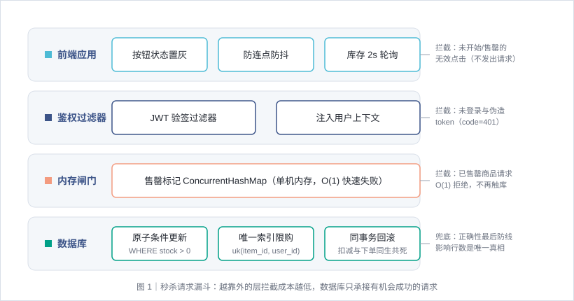
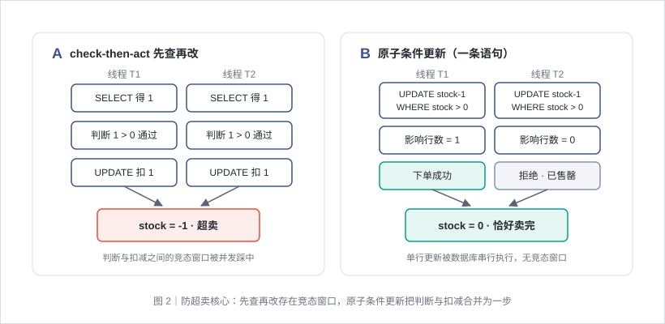

# 秒杀 / 高并发抢购 · 场景说明

> 经典前后端场景复现系列。本文只讲这个场景本身：它解决什么问题、如何设计、有哪些取舍与陷阱，不绑定任何具体工程实现。

## 一、场景概述

秒杀是「瞬时流量洪峰 × 有限库存」的极端组合：平时 QPS 个位数的商品页，开抢瞬间涌入成千上万请求，而库存只有几百件——**绝大多数请求注定失败，系统的任务是在洪峰里又快又对地筛出那极少数成功者**。

它带来两个经典问题：

- **超卖**：库存 100 件却卖出 120 单——资损事故，绝对红线；
- **少卖**：库存还有，接口却全量拒绝——体验事故，流量放过少了。

辅助问题同样致命：同一用户重复下单（黄牛脚本）、请求绕过前端直达接口、售罄后洪峰仍在捶数据库。

本场景的核心链路：**浏览秒杀列表（实时库存/状态）→ 到点抢购（校验 → 扣库存 → 建订单，三者原子）→ 查询我的订单**。

## 二、总体架构：请求漏斗



秒杀架构的本质是一个**漏斗**：越靠外的层拦截成本越低、吞吐越高，最内层的数据库只应承接「理论上有机会成功」的流量。

| 层 | 职责 | 拦截成本 |
| --- | --- | --- |
| 前端应用 | 未开始/已结束/售罄按钮置灰；防连点；到点前不发起请求 | 免费 |
| 鉴权过滤器 | 校验 JWT，未登录请求进不了业务层 | 一次验签（微秒级） |
| 应用层内存闸门 | 每商品一个内存售罄标记，已售罄 O(1) 直接拒绝，不再触库 | 无锁读 |
| 数据库原子扣减 | `UPDATE ... SET stock = stock - 1 WHERE stock > 0`，正确性基石 | 一次行级原子更新 |
| 唯一索引兜底 | `(item_id, user_id)` 唯一约束，重复下单在数据库层被物理拒绝 | 一次索引插入 |

注意层的分工：**内存标记只负责性能，不负责正确性**——就算它误判（比如多实例间不同步），数据库的条件更新仍然保证不超卖；反过来，数据库不需要承洪峰压力，靠外层把死流量挡掉。

## 三、防超卖：为什么「先查再改」必死



新手写法是「先查再改」（check-then-act）：

```sql
-- 第 1 步：查库存
SELECT stock FROM flash_items WHERE id = 1;   -- 返回 1
-- 第 2 步：应用层判断 stock > 0，执行扣减
UPDATE flash_items SET stock = stock - 1 WHERE id = 1;
```

并发下，**N 个请求可以同时完成第 1 步、都看到 stock=1、都通过判断、都执行第 2 步**——库存被扣成负数，超卖发生。判断和扣减之间存在竞态窗口（race condition），窗口在高并发下必然被踩中。

解法是把「判断 + 扣减」合并成**一条原子语句**：

```sql
UPDATE flash_items SET stock = stock - 1 WHERE id = 1 AND stock > 0;
-- 影响行数 = 0 ⇔ 此刻库存已为 0，本次抢购失败
```

数据库对单行更新串行执行（行锁），`WHERE stock > 0` 的判断与赋值在同一原子动作里完成——不存在「看到 1 才决定扣」的窗口。**应用层只认影响行数，不认先前查到的任何值**。

在原子扣减之上，再叠两道防线构成完整方案：

1. **内存售罄标记**（性能层）：`ConcurrentHashMap<itemId, AtomicBoolean>`，库存确认归零后打标记，后续请求 O(1) 拒绝——把洪峰拦在数据库之外；
2. **同事务回滚**（一致性层）：扣库存与插订单在同一个事务，插订单失败（重复抢购撞唯一索引）则库存扣减一并回滚——**扣了库存却没有订单**与**有订单却没扣库存**都不允许发生；
3. **唯一索引 `(item_id, user_id)`**（幂等层）：限购一件由数据库约束物理保证，应用层的「先查订单」只是减少无效扣减的优化，不是正确性依据。

最终的不变式（对账式）：**成功订单数 + 剩余库存 == 初始库存**，任何时刻、任何并发下都必须成立。

## 四、数据模型

两张表，刻意做了两处冗余：

| 表 | 字段要点 | 设计理由 |
| --- | --- | --- |
| `flash_items` 秒杀商品 | `total_stock` 初始库存 + `stock` 剩余库存双字段；`start_time`/`end_time` 活动窗口 | `total_stock` 是对账基准，卖完后 `stock=0` 与订单数相加应等于它 |
| `flash_orders` 秒杀订单 | `uk(item_id, user_id)` 唯一索引；冗余 `item_name`/`price` 快照字段 | 限购一件靠唯一索引兜底；商品后续改名改价不影响已下订单 |

金额字段一律 **BIGINT 存分**（`699900` = ¥6999.00），不用浮点、不用 DECIMAL 序列化——「金额永远用最小货币单位整数」是支付系统的第一铁律。

订单状态本场景只有 `0=已抢购`（成交即终态，不做支付），预留字段供「超时未支付回补库存」的延伸演进。

## 五、接口契约

约定：响应统一 `{code, msg, data}`；秒杀域错误码使用 **61xx 分段**（与 HTTP 语义码区分，前端按 `code !== 200` 统一 reject 并展示 `msg`）；所有 `/flash/**` 接口需 Bearer token（登录态来自场景 01）。

| 接口 | 语义 | 成功返回 | 失败 |
| --- | --- | --- | --- |
| GET /flash/items | 秒杀商品列表（实时库存、状态、当前用户是否已抢） | 商品数组，状态 `NOT_STARTED`/`IN_PROGRESS`/`ENDED`，每项含 `mine` 标记 | 未登录 401 |
| POST /flash/items/{itemId}/seckill | 抢购下单 | 订单信息（订单号、商品快照、价格、时间） | 6101 未开始；6102 已结束；6103 已售罄；6104 重复抢购；404 商品不存在 |
| GET /flash/orders/mine | 当前用户的抢购订单 | 订单数组（时间倒序） | 未登录 401 |
| POST /flash/demo/reset/{itemId} | **演示专用**：库存回满 total_stock + 物理清空该商品订单（释放唯一索引）+ 清除内存售罄标记 | 空 data | 非进行中活动 417；404 商品不存在 |

前端在上述接口之上内建**并发演示控制台**（浏览器端真实发起洪峰）：批量注册虚拟用户（注册即登录）→ 并发抢购 → 实时统计（成功/售罄/限购分布、逐请求日志含 RT）→ 服务端对账面板验证不变式；另提供「单用户连点」模式演示限购兜底。

## 六、关键设计取舍

| 决策点 | 本场景选择 | 取舍理由 |
| --- | --- | --- |
| 防超卖核心 | 数据库原子条件更新 | 单语句原子性 + 行锁串行，正确性不依赖应用层时序；先理解数据库层正确性，再谈缓存层性能 |
| Redis 预扣库存 | 不引入 | 单库方案已保证正确性；引入 Redis 是性能扩展（热点商品、万级 QPS），列入延伸方向——先用对再上快 |
| 悲观锁 vs 原子 UPDATE | `WHERE stock > 0` 条件更新 | `SELECT FOR UPDATE` 悲观锁在事务持锁期间串行阻塞，连接池被长事务占满；单条件更新锁粒度最小、持锁最短 |
| 扣减与下单顺序 | 先扣库存、再插订单、同事务 | 插订单失败回滚扣减；若反过来「先插订单再扣库存」，扣减失败回滚订单同样成立，但先扣能把无效请求挡在索引写入之前 |
| 下单减 vs 支付减 | 下单即扣库存 | 支付减库存会出现「下单占位不付款」的黄牛占坑；本场景无支付，下单即成交（支付回补见场景 07 衔接） |
| 削峰 MQ | 不引入 | 同步链路是教学主线；异步下单引入消息可靠性、幂等消费等新问题，列入延伸方向 |
| 接口限流 | 预留 429 码，不实现 | 单用户幂等已由唯一索引保证；全局限流（令牌桶/验证码）是独立的流量治理课题 |

## 七、安全边界与已知局限

- 内存售罄标记**单机有效**：多实例部署时实例间不同步——但方向安全（宁可标记丢失多查几次库，不会误放行导致超卖），分布式标记需 Redis（延伸）；
- 售罄标记**只进不出**：本场景无库存回补（取消订单），标记不会误杀；接入回补时需同步清标记；
- 无全局限流与验证码：脚本仍可高频捶接口打满连接池与 CPU（429 码已预留）；
- 前端按钮置灰只是体验优化，**服务端才是正确性的唯一防线**（脚本可绕过任何前端检查）；
- 秒杀商品由种子数据维护，无后台管理接口；
- `POST /flash/demo/reset/{itemId}` 是**演示专用**运维入口，任何登录用户可调用且会清空该商品全部订单——生产环境必须下线或加管理权限与审计，它是复现实验的可循环装置，不是业务功能。

## 八、验证策略

秒杀场景的测试核心是**用并发制造竞态窗口**，断言不变式而非单次结果：

1. **并发防超卖**：预置 200 个用户并发抢库存 5 的商品 → 成功订单数必须恰好 5，剩余库存 0，对账式 `订单数 + 库存 == 初始库存` 成立；
2. **限购幂等**：同一用户重复抢购（含并发重复提交）→ 仅 1 单，后续 6104；
3. **状态边界**：未开始 6101、已结束 6102、不存在的商品 404；
4. **认证边界**：无 token 访问 /flash/** → 401；
5. **功能链路**：登录 → 列表（状态/我已抢）→ 抢购 → 我的订单；
6. **冒烟脚本**：curl 全链路 + shell 后台并发小规模压测演示 + 演示重置步骤（脚本可重复运行）；
7. **浏览器端洪峰**：并发演示控制台跑「多用户洪峰」与「单用户连点」，页面上应看到统计分布、逐请求日志与服务端对账不变式成立。

## 九、延伸方向

Redis 预扣库存（Lua 脚本原子 decr + DB 异步落账）· MQ 异步下单削峰 · 令牌桶限流 + 验证码/答题打散请求 · 订单超时取消回补库存 · 热点商品多级缓存（场景 10）· 分布式锁与库存分桶（场景 09）· 对账与库存水位监控。
