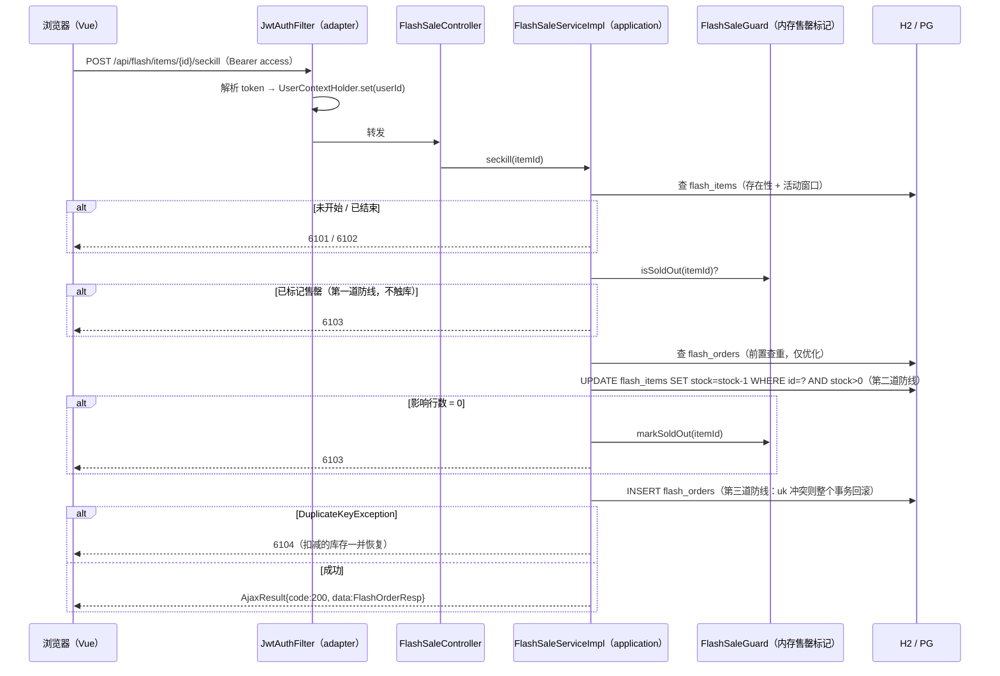

# 场景 03 · 秒杀 / 高并发抢购设计文档

> 需求名称：秒杀 / 高并发抢购 · 文件 slug：`flash-sale` · 任务前缀：`flash-sale`
> 契约状态：**冻结基线**（阶段一确认后，前后端以本文「六、接口设计」为唯一事实并行开发）
> 文档分工：本文是面向开发的设计文档（含项目实现细节与踩坑实测）；前端「技术说明文档」页渲染的纯场景讲义另见 [design.md](./design.md)

## 一、需求概述

在现有前后端基座（场景 01 已提供登录态）上实现秒杀抢购：**浏览秒杀列表（实时库存/状态）→ 到点抢购（校验 → 扣库存 → 建订单，三者原子）→ 查询我的订单**，并在前端提供并发演示控制台，完整呈现高并发抢购全过程。

- 谁在用：任何「瞬时洪峰 × 有限库存」的活动页（电商大促、票务、抢号）；本仓库把它作为场景 03 的经典复现。
- 核心矛盾：绝大多数请求注定失败，系统要在洪峰里又快又对地筛出极少数成功者——不超卖（资损红线）、不少卖（体验事故）、不重复下单（黄牛脚本）。
- 用户目标：跑通「列表、抢购、限购、订单查询」四件事 + 浏览器端可反复演示的并发洪峰，并验证对账不变式 `成功订单数 + 剩余库存 == 初始库存`。

**非目标**（本场景不做）：

- Redis 预扣库存、Lua 原子脚本（性能扩展，延伸方向；场景 09/10 再演进）；
- MQ 异步下单削峰、消息可靠性；
- 支付与订单超时取消/库存回补（场景 07 衔接）；
- 全局限流（令牌桶）、验证码/答题打散（429 码已预留）；
- 秒杀商品后台管理（种子数据维护）。

## 二、需求头脑风暴（方案取舍）

| 决策点 | 选了什么 | 没选什么 | 为什么 |
| --- | --- | --- | --- |
| 防超卖核心 | 数据库原子条件更新：`UPDATE ... SET stock = stock - 1 WHERE id = ? AND stock > 0`，只认影响行数 | Redis 预扣库存（Lua decr）；`SELECT FOR UPDATE` 悲观锁 | 单语句原子性 + 行锁串行，正确性不依赖应用层时序；先用对再上快；悲观锁持锁期间串行阻塞、占满连接池 |
| 先查再改 | 禁止 check-then-act（先 SELECT 判断再 UPDATE） | — | 判断与扣减之间的竞态窗口在高并发下必然被踩中 → 超卖；这是本场景要复现的头号经典错误 |
| 扣减与下单 | 先扣库存、再插订单、同一事务回滚 | 拆两个事务；先插订单再扣库存 | 插订单撞唯一索引则扣减一并回滚，「扣了没单」「有单没扣」都不允许发生 |
| 洪峰拦截 | 内存售罄标记（`ConcurrentHashMap<itemId, AtomicBoolean>`，O(1) 拒绝，不触库） | 每请求都打数据库 | 已售罄商品占洪峰绝大多数；标记只做性能不做正确性（丢失只会多几次原子更新，不会超卖），多实例不同步是安全方向 |
| 限购幂等 | `uk(item_id, user_id)` 唯一索引物理兜底 + 前置查重仅作优化 | 只靠应用层查重 | 查重存在竞态窗口，数据库约束才是物理保证 |
| 错误码 | 61xx 分段：6101 未开始 / 6102 已结束 / 6103 已售罄 / 6104 重复抢购 | 复用 HTTP 语义码（409/410…） | 秒杀的失败大多是正常业务结果；`BusinessException(String code, msg)` + `buildCodeAndMessage` 原生支持任意数字码，前端按 `code!==200` 统一展示 msg |
| 金额 | BIGINT 存分，展示层换算元 | DECIMAL/浮点序列化 | 「金额永远用最小货币单位整数」，规避精度与序列化问题 |
| 演示可循环 | 演示专用重置接口三件套：库存回满 + 订单**物理**删除 + 售罄标记清除 | 重启后端恢复种子 | 前端并发演示要反复跑；逻辑删除不释放唯一索引、售罄标记只进不出，三件缺一演示就坏 |
| 前端洪峰用户 | `flashRace.js` 独立裸 axios 实例（各自 Bearer token） | 复用 `http.js` | http.js 请求拦截器会无条件覆盖 Authorization 头；虚拟用户 token 必须与当前登录态隔离 |
| 注册节流 | 洪峰用户分批 8 并发注册（BCrypt ~80ms/次） | 一次全量注册 | 24 用户约 1s 完成，不打满 CPU；开抢加随机 0~400ms 起跑差，日志流可读且更接近真实点击分布 |

## 三、数据模型设计

### 表结构：`flash_items`（秒杀商品，新建）

| 字段 | 类型 | 约束 | 说明 |
| --- | --- | --- | --- |
| id | BIGINT | PK | 种子固定 1–4（雪花 ASSIGN_ID 不冲突） |
| name | VARCHAR(100) | NOT NULL | 商品名 |
| price / original_price | BIGINT | NOT NULL | 秒杀价 / 原价，单位分 |
| total_stock | INT | NOT NULL | 初始库存——对账基准：`成功订单数 + stock` 恒等于它 |
| stock | INT | NOT NULL | 剩余库存 |
| start_time / end_time | TIMESTAMP | NOT NULL | 活动窗口；状态由 now 推导（NOT_STARTED/IN_PROGRESS/ENDED），不落库 |
| 审计字段 | — | — | `BaseEntity` 自动填充 + `deleted` 逻辑删除 |

### 表结构：`flash_orders`（秒杀订单，新建）

| 字段 | 类型 | 约束 | 说明 |
| --- | --- | --- | --- |
| id | BIGINT | PK | 雪花，即对外订单号 |
| item_id + user_id | BIGINT | **UNIQUE (item_id, user_id)** | 每人限购一件的物理保证（防超卖第三道防线） |
| item_name / price | — | NOT NULL | 下单快照：商品后续改名改价不影响已下订单 |
| status | INT | DEFAULT 0 | 0=已抢购（预留 1=已取消/回补） |

实体 `FlashItem` / `FlashOrder extends BaseIdEntity`；Mapper 落位 `infrastructure.mapper`（`@MapperScan` 固定扫描），`FlashItemMapper` 的 SQL 在同包 XML `resources/mapper/FlashItemMapper.xml`（deductStock / resetStock）。

### 数据变更策略（项目无迁移工具，沿用 README「表结构由各场景手工初始化」约定）

| 环境 | 落位 | 执行主体与时机 |
| --- | --- | --- |
| H2（默认/测试） | `demo-starter/src/main/resources/schema.sql`、`data.sql` 追加 | 启动自动执行（`spring.sql.init`，encoding UTF-8 已有） |
| PostgreSQL | `scenarios/03-flash-sale/sql/postgresql.sql`（DDL + 种子合一） | 手工执行（`now() ± interval` 方言） |
| 回滚 | H2 重启即空；PG 手工 `DROP TABLE flash_orders, flash_items` | — |

种子四档状态（时间相对启动时刻生成，任意时刻启动都可演示）：1/2 进行中（库存 50 / **5**，耳机小库存专为观察售罄）、3 未开始（+1 天）、4 已结束（-1 天）。

## 四、业务流程

### 抢购主链路（细节时序）

### 前端并发演示控制台（浏览器端真实洪峰）

1. **多用户洪峰**：分批 8 并发注册 N（4–50，默认 24）个虚拟用户（注册即登录拿 token）→ 随机 0~400ms 起跑差并发 `raceSeckill` → 逐请求记录结果码与 RT（`performance.now()`）→ 实时统计（成功/售罄/限购/其他 + 三色比率条 + 耗时/平均 RT）→ 结束后拉 `/flash/items` 服务端对账（`初始 − 成功 == 剩余` 断言展示）；
2. **单用户连点**：当前登录用户 12 连击 → 恰 1 成功 + 11×6104，演示限购兜底；竞速后「我的订单」自动刷新；
3. **重置演示库存**：一键调用重置接口，回到初始状态可无限循环；商品卡片随 2s 自动刷新同步跳动。

## 五、影响范围

### 后端（按模块，遵循依赖方向 shared ← domain ← infrastructure；domain+client ← application；application+client ← adapter）

| 模块 | 变更 |
| --- | --- |
| `demo-domain` | `flash/FlashItem`、`FlashOrder` 实体；`flash/gateway/FlashItemGateway`（findAll/findById/deductStock/resetStock）、`FlashOrderGateway`（insert/findByItemAndUser/findByUserId…/deleteByItemId）端口 |
| `demo-client` | `dto/flash/`：`FlashErrorCodes`（61xx 常量）、`FlashItemResp`、`FlashOrderResp`（record）；`service/FlashSaleService` 接口 |
| `demo-application` | `flash/FlashSaleServiceImpl`（三层防线编排，seckill 加 `@Transactional`）；`flash/FlashSaleGuard`（内存售罄标记：markSoldOut / clearSoldOut） |
| `demo-infrastructure` | `mapper/FlashItemMapper`（SQL 在 `resources/mapper/FlashItemMapper.xml`：deductStock 原子扣减、resetStock 回满）+ `mapper/FlashOrderMapper`（含 `@Delete` 物理删除——逻辑删除不释放唯一索引）；`gateway/` 两个 GatewayImpl |
| `demo-adapter` | `controller/FlashSaleController`（items / seckill / orders/mine / **demo/reset**）；`config/AuthFilterConfig` patterns 扩展为 `/user/* + /flash/*`（该类 javadoc 预留的扩展点，新路径无既有调用方） |
| `demo-starter` | `schema.sql`/`data.sql` 追加（主/测试同机制）；无 yml 变更、无新依赖 |

关键点：零新增三方依赖（本机 Maven 内网镜像不可达的现实约束，也是「单库先做对」的教学取舍）；应用层只见 Gateway 端口，同场景 01 的端口反转模式。

### 前端（`frontend/`）

| 文件 | 变更 |
| --- | --- |
| `src/api/flashSale.js`（新） | listFlashItems / seckillFlashItem / listMyFlashOrders / resetFlashDemoItem |
| `src/api/flashRace.js`（新） | 洪峰专用裸 axios 实例：registerRaceUser / raceSeckill（永不 reject，HTTP 异常归入结果码） |
| `src/views/scenario/FlashSaleView.vue`（新） | 商品卡片（价格/原价/库存进度/状态徽标/倒计时/六态按钮）+ 并发演示控制台 + 我的订单；2s 自动刷新开关 |
| `src/router/index.js` | 布局 children 成对追加 `scenario/03-flash-sale` 与 `/doc` 两条路由 |
| `src/config/scenarios.js` | 03 置 `enabled: true` + desc |
| `src/config/scenarioDocs.js` | 登记 `design.md ?raw` 与两张 SVG `?url`（**只登记讲义 design.md，不登记本文**） |

### 文档与场景资产

| 位置 | 变更 |
| --- | --- |
| `scenarios/03-flash-sale/design.md` | 纯场景讲义（前端技术文档页渲染，不含项目相关内容） |
| `scenarios/03-flash-sale/diagrams/*.svg` | 两张配图（research-svg 生成） |
| `scenarios/03-flash-sale/verify.sh` | 9 步 curl 冒烟（第 8 步重置使脚本可重复运行；`FLASH_BASE` 可换端口） |
| `AGENTS.md` | 注意事项增 /flash/* 拦截、61xx 错误码、金额存分、演示重置接口 |

## 六、接口设计（冻结契约）

统一约定：路径含 context-path `/api`；响应 `AjaxResult{code, msg, data}`；秒杀域业务码 **61xx**；所有 `/flash/**` 需 `Authorization: Bearer <accessToken>`（`JwtAuthFilter` 拦截，未带/无效 → HTTP 200 + `code=401`）；金额单位分。

### 1. GET /flash/items（受保护）

- 成功：`data: FlashItemResp[]`——`{id, name, price, originalPrice, totalStock, stock, startTime, endTime, status("NOT_STARTED"|"IN_PROGRESS"|"ENDED"，服务端推导), mine(当前用户是否已抢)}`
- 数据操作：**读** `flash_items` 全量（id 升序）+ **读** 当前用户全部 `flash_orders`（一次查询构建 mine 集合，不逐商品查）

### 2. POST /flash/items/{itemId}/seckill（受保护，核心）

- 成功：`data: FlashOrderResp{orderId, itemId, itemName, price, status, createTime}`
- 失败：404 商品不存在 / 6101 未开始 / 6102 已结束 / 6103 已售罄 / 6104 重复抢购
- 数据操作（单事务）：**读** `flash_items`（存在性 + 窗口）→ **读** `flash_orders`（前置查重，仅优化）→ **原子更新** `flash_items`（`stock = stock - 1 WHERE stock > 0`）→ **写** `flash_orders`（唯一索引兜底，冲突回滚全事务）

### 3. GET /flash/orders/mine（受保护）

- 成功：`data: FlashOrderResp[]`（创建时间倒序）
- 数据操作：**读** `flash_orders` 按 userId

### 4. POST /flash/demo/reset/{itemId}（受保护，**演示专用**）

- 语义：库存回满 `total_stock` + **物理删除**该商品全部订单（释放唯一索引）+ 清除内存售罄标记；三件缺一不可
- 失败：404 商品不存在 / 417 非进行中活动
- 数据操作（单事务）：**读** `flash_items`（状态守卫）→ **更新** `flash_items.stock = total_stock` → **物理删除** `flash_orders` 按 itemId → 清除 Guard 标记（内存）
- 安全语义：任何登录用户可调用且会清空该商品全部订单——生产环境必须下线或加管理权限与审计（AGENTS.md 已注明）

## 七、模块拆分建议

首轮 7 个任务按依赖拓扑：01 数据模型 → 02 契约 → 03 服务 → 04 API → 05 并发测试 → 06 前端（依赖 02+04，可与 03/04 并行）→ 07 文档收尾；增量 2 个任务：08 演示重置接口（后端）、09 并发演示控制台（前端）。任务文件见 `tasks/`（`flash-sale_NN_*.md`），状态与执行记录以任务文件为准。

## 八、非功能性需求

- **安全**：正确性全部收敛在服务端（前端置灰只是体验）；演示重置接口的权限语义见六.4；61xx ≥ 500 会被 `GlobalExceptionHandler` 按 ERROR 级记日志（isClientError 只认 400–499）——已知取舍，common 层扩业务码日志规则时再处理。
- **性能**：H2 单行热点更新 + Hikari 默认 10 连接是瓶颈预判；未做真实压测，正确性由并发不变式覆盖（见十）。
- **兼容性**：`/user/*` 拦截行为不变（场景 01 回归 10 用例）；无 yml/依赖变更。
- **可观测**：秒杀成功打 info（itemId/userId/orderId）；业务失败经统一异常处理；日志不含 token 原文。

## 九、开发与验证建议

- 后端：`cd backend && mvn test`（22 用例：场景 01 回归 10 + contextLoads + 秒杀 11）；
- 前端：`cd frontend && npm run build`（无 lint/test，构建为唯一校验）+ 浏览器手动验收；
- 冒烟：`bash scenarios/03-flash-sale/verify.sh`（8080 被占时 `FLASH_BASE=http://localhost:8081/api`；含并发演示与重置步骤，可重复运行）；
- 浏览器验收清单：四档状态展示 → 抢购/重复 6104 提示 → 多用户洪峰（统计 + 日志 + 对账）→ 单用户连点 → 重置循环 → 我的订单。

## 十、踩坑与实测

本仓库复现时的实际记录（环境：Windows + IDEA + H2）。

**实测结果**：

- 后端 `mvn test` 22/22（含演示重置两例：重置后同用户可复购且库存对账、已结束活动重置被拒 417）；
- 并发防超卖（Order 8）：200 个互不相同用户 CountDownLatch 同抢库存 5 的商品——成功恰 5、失败 195 且全部 6103、终态库存 0，不变式「订单数 + 库存 == 初始库存」成立；
- 单用户幂等（Order 9）：同一 token 20 线程并发抢同一商品——恰 1 单成功、19 次 6104；
- curl 冒烟 `verify.sh` 9/9 × 2 遍（同一后端连跑，验证重置使脚本可重复运行）；
- 浏览器端并发演示控制台实测：多用户洪峰 24 用户抢 5 件 → 成功 5/售罄 19，耗时 1511ms、平均 RT 44ms，日志可见 RT 随行锁排队从 23ms 递增至 62ms；单用户连点 12 连击 → 恰 1 成功 + 11×6104，复跑全 6104；重置一键循环；
- 未做真实压测（QPS/RT）：瓶颈预判在 H2 单行热点更新与 Hikari 默认 10 连接，正确性已由并发不变式覆盖。

**踩坑记录**：

| 现象 | 原因 | 解决 |
| ---- | ---- | ---- |
| 冒烟并发结果「成功 4/售罄 8」被判失败 | 目标实例库存已被上一轮消耗（剩 4 件），并非超卖——不变式其实成立 | 冒烟用新注册主用户 + 固定期望值并注明重复运行依赖重置步骤；shell 后台任务跨调用不持久，`kill %1` 无效需按 PID taskkill |
| 旧实例访问 /flash/items 返回 500 而非 404 | IDEA 调试会话里的旧版应用无 /flash 路由，No static resource 被全局异常兜底转 500 | 重启 IDE 内应用；本机验证可用 `FLASH_BASE` 指向新端口实例 |
| 冒烟注册并发用户失败 | 用户名含连字符被 `^[A-Za-z0-9_]{4,32}$` 417 拒绝 | 改用下划线；跨场景复用账号规则先看对方契约 |
| 集成测试编译错「String 无法转换为 int」 | 对 `List<Map>` 调 `.get("accessToken")`——List.get 只收索引；登录响应 data 是对象、列表接口 data 才是数组 | 按响应形状拆 data()/dataList() 辅助方法 |
| 61xx 业务失败在日志里打 ERROR 级并带堆栈 | GlobalExceptionHandler 的 isClientError 只认 400-499 | 已知取舍：61xx 是行业惯用分段，common 层扩业务码日志规则时再处理 |
| 临时联调端口登录 POST 全挂（Invalid CORS request） | 端口不在 `app.cors.allowed-origins` 白名单；GET /health 不触发预检所以「看起来正常」，POST 才暴露 | 联调只用白名单端口（5173/5174）；排查时从页面上下文 fetch 探针直接看 403 文本 |
| 洪峰虚拟用户复用 http.js 会丢自己的 token | http.js 请求拦截器会无条件覆盖 Authorization 头 | `flashRace.js` 独立裸 axios 实例，虚拟用户 token 与登录态彻底隔离 |
| 演示重置后用户仍无法抢购（6103/6104 不散） | 重置三件套缺一不可：库存回满、订单**物理**删除（逻辑删除不释放唯一索引）、售罄标记清除（只进不出会误杀） | resetDemoItem 同事务完成三件事，集成测试 Order(10) 覆盖 |
| H2 种子需四档状态随时可演示 | 固定绝对时间重启后即过期 | `CURRENT_TIMESTAMP ± INTERVAL` 相对生成（H2 方言；PostgreSQL 脚本用 `now() ± interval`） |
| 连点模式抢到后「我的订单」不刷新 | startRace 收尾只刷新了商品列表 | 收尾改 `Promise.all([loadItems(true), loadOrders()])`，复验通过 |
